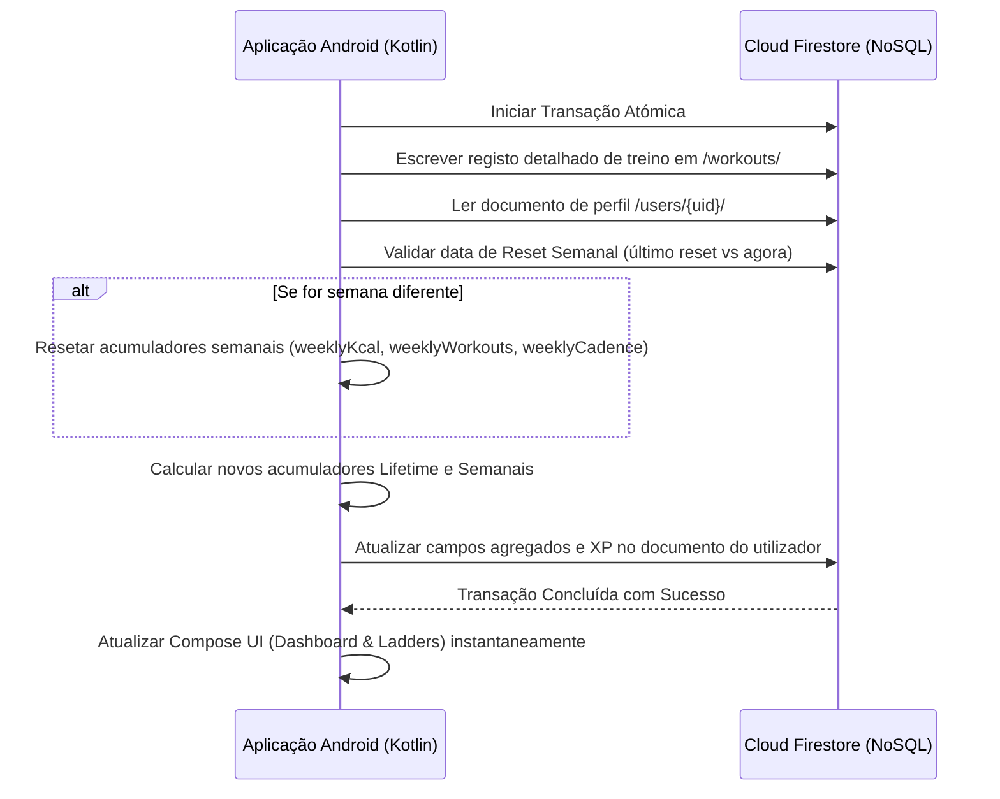

# Changelog: AI Fitness Tracker App Development

This log tracks the modifications, enhancements, and feature implementations of the Fitness Tracker application.

## [2026-07-04] NoSQL Write-Time Aggregation & Leaderboards

### Added
*   **Write-Time Client Aggregation Fields (`UserProfile.kt`)**: Added stats fields to track user performance directly on their user document:
    *   `totalKcal`, `totalReps`, `totalWorkouts`, `overallCadenceStability` (lifetime).
    *   `weeklyKcal`, `weeklyCadenceStability`, `weeklyWorkouts` (weekly reset).
    *   `lastWeeklyReset` (weekly reset marker).
*   **Leaderboards View (`ViewStatisticsActivity.kt`)**: Added a global leaderboards tab to show the top 10 users ranked by XP, Kcal, or Cadence Stability, retrieving pre-aggregated user documents directly.
*   **Workout Detail Dialog (`ViewStatisticsActivity.kt`)**: Clickable cards in the history list now open a popup showing full biomechanical analysis: Volume (Reps $\times$ Weight), Cadence Score, Concentric/Eccentric tempos, and Standard Deviation.

### Modified
*   **Transactional Stats Write (`MainActivity.kt`)**: Expanded the workout submit transaction. It now calculates cadence standard deviation, translates it to a score out of 100, and atomically aggregates overall and weekly totals, handling auto-reset on a calendar-week boundary:

---

## [2026-07-01] Delivery Restructuring & LaTeX Drafting

### Added
*   **Root Folder Structure (ISEL Guidelines)**: Created standard project delivery folders at the root: `00_Planeamento`, `01_Analise`, `02_Desenho`, `03_Implementacao`, `04_Teste`, and `_RELATORIO`.
*   **Root Index Ficheiros**:
    *   `_README.TXT`: Description of the repository, authors (Rodrigo Correia #45155, David Delgado #51598) and directory layout.
    *   `prompt_set.TXT`: Structured log of AI prompts used to design core controllers.
*   **Relatório Draft (`_RELATORIO/overleaf/`)**: Created and fully drafted the LaTeX template inside `_RELATORIO/overleaf` (configured abstract, metadata, and Chapters 1 to 6).

### Modified
*   **Project Relocation**: Moved `AndroidApp_V_0.1/` and `POC_Python/` into `03_Implementacao/` folder.
*   **Gitignore Paths**: Configured `.gitignore` to exclude `documentos fornecidos projeto/` and `_RELATORIO/overleaf/` to prevent committing templates.
*   **Build Validation**: Confirmed that moving `AndroidApp_V_0.1` to the subdirectory compiles successfully using `./gradlew.bat compileDebugKotlin`.

---

## [2026-06-16] Milestone 3 Refinements: Audio Guidance Cues (Text-To-Speech)

### Added
*   **Text-To-Speech Coaching Assistant (`TTSHelper.kt`)**: Implemented a native Android `TextToSpeech` manager. It is configured to run rate-limited verbal instructions to prevent voice overlapping (4-second cooldown), while supporting an immediate override for rep completions and countdown progress.
*   **Calibration Screen Audio Warning (`OverlayView.kt`)**: Added a clear notification text *"Note: Audio guidance will be used and is advised (optional)"* at the bottom of the start position card. This informs athletes that audio coaching is active without making it mandatory.

### Modified
*   **Guided Workout Plan Audio Cues (`MainActivity.kt`)**:
    *   Instructs TTS to announce the start of each workout step (e.g. *"Start Squat exercise. Target is 10 reps."*) or resting breaks.
    *   Announces each completed repetition immediately with its score and form coaching notes (e.g. *"Rep 3. Score 88. Go deeper."*).
    *   Announces real-time exercise execution hints (e.g., *"Sit back, go deeper..."*, *"Rest finished! Get ready."*).
*   **Single Exercise Testing Audio Feedback (`ExerciseTestActivity.kt`)**:
    *   Announces the startup countdown verbally (e.g., *"Get ready! 5, 4, 3, 2, 1, Go!"*).
    *   Announces completed repetitions and scores for reps-based exercises, and hold status prompts for time-based exercises (e.g. Plank).

---

## [2026-06-15] Milestone 4: Workout Plan Integration & Statistics Dashboard

### Added
*   **Workout Plan Detail Screen (`StartPlanActivity.kt`)**: Replaced the static placeholder with a fully styled training overview. Shows badges for estimated duration (~1.5 mins), MET (6.0), and average calorie burn (~15 kcal), as well as a list of workout steps: 10 Squats, 15s Rest, and 10 Lunges. Includes a premium gradient "START WORKOUT" button that initiates the camera workout.
*   **Activity Statistics Screen (`ViewStatisticsActivity.kt`)**: Implemented the full Jetpack Compose dashboard for user activity:
    *   **Live Firestore Query**: Queries `/users/{uid}/workouts` ordered by date descending to fetch historical data.
    *   **Custom Canvas Bar Chart**: Draws a custom 7-day progress bar chart in Compose `Canvas` showing repetitions completed per day. Includes vertical neon sweep gradients and animated scaling on screen load.
    *   **Biometric Stats Cards**: Dynamically aggregates total workouts completed, active time (formatted in minutes or hours/minutes), total calories burned, and average form score.
    *   **Activity Log**: Shows a chronological list of recent workouts, detailing the name, reps, exact date/time, duration, average form score, and calories burned.
    *   **Developer Actions**: Added a "Clear History" button to wipe the user's workouts sub-collection and a "Seed Mock Data" button to auto-generate 5 past workouts for robust visual testing.

### Modified
*   **Guided Workout Plan Loop (`MainActivity.kt` & `WorkoutManager.kt`)**: Exposed training steps list in `WorkoutManager` and updated `MainActivity` to run the Squat-Rest-Lunge sequence.
*   **Workout Persistence & Scoring (`MainActivity.kt`)**:
    *   Calculates active duration and MET-based calories: `MET (6.0) * 3.5 * weight / 200 * (duration / 60)`. Weight is queried dynamically from user profile (defaulting to 70.0 kg).
    *   Stores the workout log in the Firestore sub-collection `/users/{uid}/workouts`.
    *   Updates the user's Profile (`xpPoints` and `level`) in a Firestore Transaction, awarding `(reps * 10) + (avgScore / 2)` XP.
    *   Launches `ResultActivity` passing the aggregated metrics.

---

## [2026-06-10] Milestone 1 Layout Fixes: Tablet Centering & Title Re-alignment

### Added
*   **Friends Online/Offline Status & Two-way Confirmation Requests**:
    *   Added `lastActive` timestamp tracking to the user profile model [UserProfile.kt](file:///c:/Users/rodri/OneDrive/Documentos/GitHub/Final_Project_FitnessTracker/AndroidApp_V_0.1/app/src/main/java/com/example/fitnesstrackerapp/logic/UserProfile.kt) with safe millisecond translation and fallback to `modifiedAt` if the field is missing.
    *   Configured [RegisterActivity.kt](file:///c:/Users/rodri/OneDrive/Documentos/GitHub/Final_Project_FitnessTracker/AndroidApp_V_0.1/app/src/main/java/com/example/fitnesstrackerapp/RegisterActivity.kt) and [EditProfileActivity.kt](file:///c:/Users/rodri/OneDrive/Documentos/GitHub/Final_Project_FitnessTracker/AndroidApp_V_0.1/app/src/main/java/com/example/fitnesstrackerapp/EditProfileActivity.kt) to initialize/update `lastActive` upon creation or saving.
    *   **Two-Way Friend Request Confirmation Flow**: Implemented a friend request collection `friend_requests` in Firestore. Adding a friend in `EditProfileActivity.kt` now writes a pending friend request document rather than instantly adding them.
    *   **Pending Requests UI Section**: Added a real-time pending friend requests sub-section in [DashboardActivity.kt](file:///c:/Users/rodri/OneDrive/Documentos/GitHub/Final_Project_FitnessTracker/AndroidApp_V_0.1/app/src/main/java/com/example/fitnesstrackerapp/DashboardActivity.kt). Users see incoming requests with "Accept" and "Decline" actions.
    *   **Transactional Accept Flow**: Clicking "Accept" triggers a safe Firestore Transaction that atomically:
        1. Appends the sender's code to the receiver's `friendsList`.
        2. Appends the receiver's code to the sender's `friendsList`.
        3. Deletes the pending request document.
    *   **Real-time Snapshot Syncing**: Refactored `DashboardActivity.kt` and `EditProfileActivity.kt` to use reactive Firestore snapshot listeners (`addSnapshotListener` inside Compose `DisposableEffect`). This ensures that changes to the user's profile, friends lists, online statuses, and pending requests are pushed instantly to the user interface in real-time.
    *   **Friend Name Mapping in Editor**: Implemented a side-effect query inside `EditProfileActivity.kt` to resolve and cache names corresponding to the 5-digit codes in the user's friends list, displaying them as `Name (Code)` (e.g. `Tomás Correia (#15439)`) in the active list.
    *   Configured [DashboardActivity.kt](file:///c:/Users/rodri/OneDrive/Documentos/GitHub/Final_Project_FitnessTracker/AndroidApp_V_0.1/app/src/main/java/com/example/fitnesstrackerapp/DashboardActivity.kt) to automatically update the current user's `lastActive` timestamp in Firestore when the dashboard opens.
    *   Implemented a query in `DashboardActivity.kt` that fetches the profile and active status of all added friends, displaying them dynamically at the bottom of the main hub under a new "Friends Status" section.
    *   Friends are listed with their name, code, a green online dot if active within 5 minutes, or a relative offline timestamp (e.g. "Active 2h ago", "Active >72h ago") if not. Added interactive placeholder text buttons for "Challenge" and "Stats" actions.
    *   Realigned the dashboard layout to a scrollable `Column` container, replacing the previous full-screen `LazyVerticalGrid` with a 3x2 chunked `Row` structure to enable scrolling down to check the friends status.
*   **Tablet Layout & Centering Constraints**: Wrapped all Compose activity screens (`LandingScreen`, `RegisterScreen`, `DashboardScreen`, `EditProfileScreen`, `PlaceholderScreen`, `LoaderScreen`) in parent `Box` containers with `Modifier.widthIn(max = 480.dp)` or `540.dp` to prevent horizontal stretching on wider screens (tablets) and keep elements elegantly centered.
*   **Locked Portrait Mode**: Updated [AndroidManifest.xml](file:///c:/Users/rodri/OneDrive/Documentos/GitHub/Final_Project_FitnessTracker/AndroidApp_V_0.1/app/src/main/AndroidManifest.xml) to explicitly add `android:screenOrientation="portrait"` to all 10 activities, preventing accidental landscape rotation that conflicts with camera-based body pose tracking.

*   **Landing Activity Branding Spacing & Font Scaling**: Refactored the branding section of `LandingScreen` in [LandingActivity.kt](file:///c:/Users/rodri/OneDrive/Documentos/GitHub/Final_Project_FitnessTracker/AndroidApp_V_0.1/app/src/main/java/com/example/fitnesstrackerapp/LandingActivity.kt):
    *   Split the "FITNESS TRACKER" branding text into two separate, explicit Compose `Text` views ("FITNESS" and "TRACKER") separated by a `6.dp` vertical `Spacer` to completely resolve vertical overlapping caused by text wrapping.
    *   Increased the branding font size from `38.sp` to `44.sp` for a more premium visual layout.
    *   Increased vertical spacing between the title branding and the subtitle ("Train anywhere you want!") to `16.dp` to prevent visual clutter.
    *   Added a `Spacer` at the top of the scrollable column to push the text block slightly downwards while keeping the entire view balanced and centered.

---

## [2026-06-10] Milestone 1 Refinements: UI/UX & Data Formatting

### Added
*   **Forgot Password Dialog**: Integrated a stateful "Forgot Password?" dialog inside [LandingActivity.kt](file:///c:/Users/rodri/OneDrive/Documentos/GitHub/Final_Project_FitnessTracker/AndroidApp_V_0.1/app/src/main/java/com/example/fitnesstrackerapp/LandingActivity.kt) to send reset verification emails using `FirebaseAuth.getInstance().sendPasswordResetEmail`.
*   **Sign Out Action**: Added a red "Sign Out" text button in [DashboardActivity.kt](file:///c:/Users/rodri/OneDrive/Documentos/GitHub/Final_Project_FitnessTracker/AndroidApp_V_0.1/app/src/main/java/com/example/fitnesstrackerapp/DashboardActivity.kt) that clears the session using `FirebaseAuth.getInstance().signOut()` and routes back to the landing page.
*   **First Name Parser**: Implemented a parser in the dashboard header that extracts and displays only the user's first name for a cleaner and more personal greeting (e.g. "Welcome Back, Rodrigo").
*   **Loader Activity**: Created [LoaderActivity.kt](file:///c:/Users/rodri/OneDrive/Documentos/GitHub/Final_Project_FitnessTracker/AndroidApp_V_0.1/app/src/main/java/com/example/fitnesstrackerapp/LoaderActivity.kt) which displays an animated, rotating neon sweep gradient spinner in the Antigravity color theme (cyan/purple) with a 1.5-second delay to ensure smooth transitions between major states.
*   **Shared Component File**: Created [PlaceholderScreen.kt](file:///c:/Users/rodri/OneDrive/Documentos/GitHub/Final_Project_FitnessTracker/AndroidApp_V_0.1/app/src/main/java/com/example/fitnesstrackerapp/PlaceholderScreen.kt) to share the "Coming Soon" screen design across the mock activities.

### Modified
*   **Prevent Screen Locking**: Added `WindowManager.LayoutParams.FLAG_KEEP_SCREEN_ON` to all activities (`LandingActivity`, `RegisterActivity`, `DashboardActivity`, `EditProfileActivity`, `CreatePlanActivity`, `StartPlanActivity`, `ViewStatisticsActivity`, and `LoaderActivity`) to prevent the screen from going to sleep while the app is active.
*   **Human-Readable Firestore Dates**: Refactored [UserProfile.kt](file:///c:/Users/rodri/OneDrive/Documentos/GitHub/Final_Project_FitnessTracker/AndroidApp_V_0.1/app/src/main/java/com/example/fitnesstrackerapp/logic/UserProfile.kt) to use native Firestore `Timestamp` objects instead of raw `Long` millisecond values. Added safe-resolution methods to parse both legacy `Long` records and new `Timestamp` objects to prevent crashes.
*   **User Numeric ID**:
    *   Updated [RegisterActivity.kt](file:///c:/Users/rodri/OneDrive/Documentos/GitHub/Final_Project_FitnessTracker/AndroidApp_V_0.1/app/src/main/java/com/example/fitnesstrackerapp/RegisterActivity.kt) to generate a random 5-digit numerical ID (e.g. `#12345`) upon account creation.
    *   Updated [DashboardActivity.kt](file:///c:/Users/rodri/OneDrive/Documentos/GitHub/Final_Project_FitnessTracker/AndroidApp_V_0.1/app/src/main/java/com/example/fitnesstrackerapp/DashboardActivity.kt) to fetch and display the user's name and 5-digit ID in the main greeting header.
*   **Friends List Search by Code**: Updated [EditProfileActivity.kt](file:///c:/Users/rodri/OneDrive/Documentos/GitHub/Final_Project_FitnessTracker/AndroidApp_V_0.1/app/src/main/java/com/example/fitnesstrackerapp/EditProfileActivity.kt) to query the Firestore `/users` collection when adding a friend by their 5-digit code, verifying their existence before adding them to the user's friends list.
*   **Transitions via Loader**:
    *   Configured [LandingActivity.kt](file:///c:/Users/rodri/OneDrive/Documentos/GitHub/Final_Project_FitnessTracker/AndroidApp_V_0.1/app/src/main/java/com/example/fitnesstrackerapp/LandingActivity.kt) to route through `LoaderActivity` to the dashboard upon login.
    *   Configured [DashboardActivity.kt](file:///c:/Users/rodri/OneDrive/Documentos/GitHub/Final_Project_FitnessTracker/AndroidApp_V_0.1/app/src/main/java/com/example/fitnesstrackerapp/DashboardActivity.kt) to route through `LoaderActivity` when launching `MainActivity` (Demo Workout) or `DemoPushUpActivity` (Demo Pushups).
*   [AndroidManifest.xml](file:///c:/Users/rodri/OneDrive/Documentos/GitHub/Final_Project_FitnessTracker/AndroidApp_V_0.1/app/src/main/AndroidManifest.xml): Registered `LoaderActivity` in the application manifest.

---

## [2026-06-10] Milestone 1: User Authentication & Cloud Database (Firebase)

### Added
*   **Firebase SDK Integration**: Added Google Services plugin and Firebase BOM to the Gradle build configuration files.
*   **User Data Model**: Created initial `UserProfile.kt` with fields for biometric data, gamification info, and social connections.
*   **Register Activity**: Created `RegisterActivity.kt` with a Compose registration form.

---

## [2026-06-10] Navigation & Jetpack Compose Base Setup

### Added
*   **Compose Support**: Integrated Jetpack Compose in the build scripts using Compose BOM `2024.10.00` and the Jetpack Compose compiler.
*   **Theme**: Created a custom dark-mode theme [Theme.kt](file:///c:/Users/rodri/OneDrive/Documentos/GitHub/Final_Project_FitnessTracker/AndroidApp_V_0.1/app/src/main/java/com/example/fitnesstrackerapp/ui/theme/Theme.kt) matching the Antigravity color palette.
*   **Landing Page Mockup**: Created initial `LandingActivity` with static buttons and form fields.
*   **Dashboard Hub**: Created `DashboardActivity.kt` to act as the primary navigation hub.
*   **Placeholders**: Created temporary activities for Edit Profile, Create Plan, Start Plan, and View Statistics.
