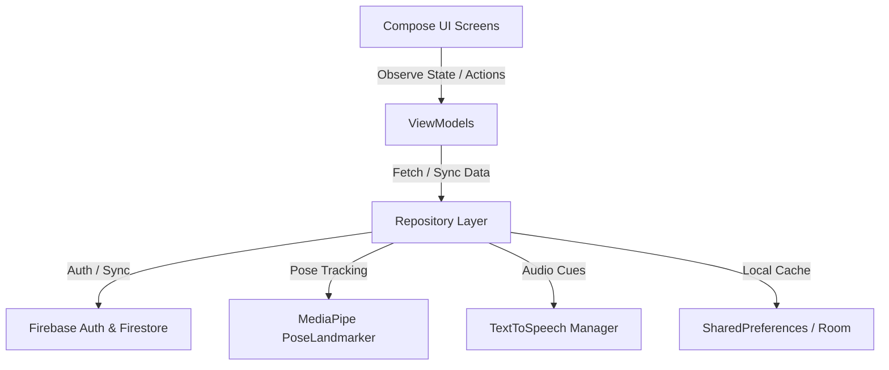

# Roadmap do Projeto: Aplicação AI Fitness Tracker (MVP)

Este roadmap detalha a arquitetura do sistema, o design da base de dados e os modelos algorítmicos do Fitness Tracker gamificado e impulsionado por AI.

---

## 🏗️ Arquitetura do Sistema (MVVM)

A aplicação utiliza uma arquitetura Android limpa e moderna que segue o padrão **MVVM (Model-View-ViewModel)**, construída inteiramente com **Jetpack Compose**. 



---

## 🎯 Marcos de Implementação (Milestones)

### 📍 Milestone 1: Autenticação de Utilizadores & Cloud Database (Firebase) ✅
O Firebase integra as contas de utilizador, personalização de perfil e persistência de dados na cloud em tempo real.

#### 1. Configuração de Firebase Authentication ✅
*   **Providers**: Ativar **Email/Password** e **Google Sign-In** na Consola Firebase.
*   **Fluxo do Utilizador**:
    1.  **Landing Screen**: Apresenta campos de texto para Email e Password. 
    2.  **Ação de Login**: Despoleta `FirebaseAuth.signInWithEmailAndPassword`. Em caso de sucesso, navega para a `DashboardActivity`.
    3.  **Registo**: Encaminha os utilizadores para uma nova `RegisterActivity` para efetuar o registo.

#### 2. Esquema Cloud Firestore ✅
Os perfis de utilizador, planos personalizados e histórico de treinos são sincronizados numa coleção principal `/users`:

##### `/users/{userId}` (User Profile Document)
```json
{
  "name": "Jane Doe",
  "numericId": "12345",
  "age": 25,
  "weightKg": 68.5,
  "heightCm": 172.0,
  "xpPoints": 1250,
  "level": 3,
  "totalKcal": 150.5,
  "totalReps": 240,
  "totalWorkouts": 12,
  "overallCadenceStability": 82.5,
  "weeklyKcal": 45.2,
  "weeklyCadenceStability": 79.8,
  "weeklyWorkouts": 3,
  "lastWeeklyReset": "2026-07-05T00:00:00Z",
  "createdAt": "2026-06-10T00:00:00Z"
}
```

##### `/users/{userId}/workouts/{workoutId}` (Workout Log Sub-collection)
```json
{
  "date": "2026-06-10T08:30:00Z",
  "workoutName": "Morning Wakeup Routine",
  "durationSeconds": 480,
  "caloriesBurned": 72.4,
  "totalReps": 35,
  "averageFormScore": 88,
  "weightKg": 0.0,
  "volume": 0.0,
  "cadenceScore": 85.0
}
```

##### `/users/{userId}/custom_plans/{planId}` (Custom Plan Sub-collection)
```json
{
  "planName": "My Strength Plan",
  "createdAt": "2026-07-05T15:00:00Z",
  "stepsJson": "[{\"type\":\"SQUAT\",\"value\":10},{\"type\":\"REST\",\"value\":30},{\"type\":\"PUSHUP\",\"value\":8}]"
}
```

---

### 📍 Milestone 2: Expansão da Biblioteca de Exercícios ✅
Exercícios suportados e a sua lógica geométrica usando 2D MediaPipe landmarks:

#### 1. Bicep Curl (Braço Único / Alternado) ✅
*   **Landmarks Principais**: Ombro (11/12), Cotovelo (13/14), Pulso (15/16).
*   **Ângulo Monitorizado**: Ângulo interno da articulação do cotovelo $\theta$.
*   **Lógica de Deteção**:
    *   **Posição Inicial (DOWN)**: Braço totalmente estendido ($\theta \ge 160^\circ$).
    *   **Posição Final (UP)**: Braço totalmente fletido ($\theta \le 45^\circ$).

#### 2. Jumping Jacks ✅
*   **Landmarks Principais**: Tornozelos Esquerdo/Direito (27/28), Ombros Esquerdo/Direito (11/12), Pulsos Esquerdo/Direito (15/16).
*   **Lógica de Deteção**:
    *   **Estado OUT (UP)**: A distância entre tornozelos é maior que a largura dos ombros ($D_{ankles} > 1.5 \times D_{shoulders}$) **E** as mãos estão levantadas acima do nível dos ombros.
    *   **Estado IN (DOWN)**: Os pés estão juntos ($D_{ankles} \approx D_{shoulders}$) **E** as mãos estão em baixo abaixo da anca.

#### 3. Overhead Shoulder Press ✅
*   **Landmarks Principais**: Ombro (11/12), Cotovelo (13/14), Pulso (15/16).
*   **Lógica de Deteção**:
    *   **Posição Inicial (DOWN)**: Cotovelos dobrados, mãos à altura dos ombros ($\theta \le 90^\circ$).
    *   **Posição Final (UP)**: Braços estendidos retos acima da cabeça ($\theta \ge 165^\circ$).

#### 4. Mountain Climbers ✅
*   **Landmarks Principais**: Ombro (11/12), Anca (23/24), Joelho (25/26), Tornozelo (27/28).
*   **Lógica de Deteção**:
    *   O utilizador mantém uma posição estável de Plank. Um ângulo alternado de flexão do joelho $\le 70^\circ$ regista uma repetição.

---

### 📍 Milestone 3: AI-Driven Scoring & Feedback de Áudio ✅
Este módulo analisa a qualidade do movimento em tempo real, fornecendo orientação visual e auditiva.

#### 1. Métrica de Form Scoring ✅
Um score ponderado de 0 a 100 é calculado para cada repetição:
*   **Range of Motion (ROM)** (até −40 pts): Verifica se a articulação atinge os ângulos alvo de flexão/extensão.
*   **Tempo Excêntrico** (até −30 pts): Penaliza uma descida demasiado rápida (sem controlo) ou demasiado lenta.
*   **Tempo Concêntrico** (até −25 pts): Penaliza o uso de balanço no levantamento.

#### 2. Text-to-Speech (TTS) Engine ✅
Utiliza o `TextToSpeech` nativo do Android em Português (`pt-PT`) com um debounce de 0.5 segundos para anunciar instruções:
*   *Correções de Postura*: "Desce mais!", "Sobe com controlo!", "Mais lento a descer!"

---

### 📍 Milestone 4: Gamificação & Analytics ✅

A gamificação da experiência de fitness ajuda os utilizadores a manterem a consistência.

#### 1. Fórmula de Kcal / Gasto Energético ✅
Calculado usando a fórmula Metabolic Equivalent of Task (MET):
$$\text{Kcal Burned} = \text{MET} \times 3.5 \times \frac{\text{Weight (kg)}}{200} \times \text{Duration (minutes)}$$

*   *Exercícios Vigorosos (Push-up, Squat, Lunge)*: **8.0 MET** (O Mini Plan utiliza uma média de **6.0 MET**)
*   *Exercícios Moderados/Core (Plank)*: **4.0 MET**
*   *Descanso / Pausa*: **1.3 MET**

#### 2. Gráficos de Progresso ✅
Desenha os históricos semanais de treinos diretamente num gráfico de barras customizado em Jetpack Compose `Canvas`.

---

## ✅ Diário de Desenvolvimento (Development Log)

### 2026-07-18 — Pequenas Correções, Localização da UI & Escrita de Relatório
*   **Correções de Código**: Resolução de um pequeno bug de scope `@Composable` no cálculo de `strings` na `DashboardActivity`.
*   **Uniformização do Idioma**: A app e documentação foram totalmente traduzidas/uniformizadas para a língua nativa Portuguesa. Adicionado um botão local no `LandingActivity` (`AppCompatDelegate`) para que novos utilizadores possam ler a Pipeline de registo no idioma preferido de imediato.
*   **Relatório Final**: Início imediato da planificação e redação em massa do relatório final de entrega (escrito logo a seguir a esta operação).

### 2026-07-16 — Hotfixes de Usabilidade & Localização Global da App
*   **In-App Language Toggle**: Resposta direta ao feedback dos testes de usabilidade! Adicionado um seletor manual `preferredLanguage` no registo de conta e edição de perfil (`AppCompatDelegate` via Compose). Implementada migração lazy de dados NoSQL para que utilizadores existentes adotem o idioma do Sistema nativamente sem scripts de base de dados forçados.
*   **Localização Global da App (`strings.xml`)**: Traduzida toda a UI para Português (pt-PT) para eliminar a barreira linguística em utilizadores de baixa literacia do Grupo A, mantendo termos específicos de fitness (Squats, Lunges, XP, Level) em Inglês.
*   **Arquitetura de Rastreamento Lunge (`LungeExercise.kt`)**: Remodelação do rastreio para seguir o joelho frontal, corrigindo permanentemente os falsos negativos causados pela oclusão mecânica.
*   **Aumento de Visibilidade HUD (`OverlayView.kt`)**: Redesign dos parâmetros de escala do overlay (contador de repetições 150f, espessura de linha 18f) para garantir legibilidade ideal a 2-6 metros.
*   **Alinhamento de Documentação**: Atualização do `RELATORIO_GUIDE.md` para mapear a Estrutura Linear oficial de 40 páginas em 6 capítulos.

### 2026-07-12 — Testes de Usabilidade & Registo de Resultados
*   **Logs de Avaliação de Usabilidade (`resultados_testes_usuabilidade.md`)**: Documentação quantitativa das 7 sessões de testes com utilizadores abrangendo 3 grupos de literacia tecnológica (baixa, média, avançada).
*   **Guia de Teste de Utilizador (`Guião  Testes Utilizadores.md`)**: Revisão do fluxo e numeração de perguntas para garantir maior consistência nas respostas.

### 2026-07-08 — Form Scoring Contínuo & Rep-Count Threshold
*   **Penalização de Profundidade Contínua (`FormEvaluator.kt`)**: Implementado um scoring linear de profundidade em vez da barreira absoluta fixa de tolerância. A penalização aumenta quanto maior a distância em relação à marca ideal de 90º.
*   **Contagem Indulgente de Repetições (`RepPhaseTracker.kt` & configs)**: Adicionados *count thresholds* (ex: 90° em vez de 70°) para contabilizar repetições superficiais em troca de penalizações no Score final em vez de as descartar.
*   **Scoring de Alinhamento na Plank (`PlankExercise.kt`)**: Adicionado o scoring dinâmico de alinhamento em relação à linha vertebral de 180° e o registo histórico em `repHistory` de cada segmento temporal aguentado.

### 2026-07-05 — Refinamentos de Usabilidade & Custom Plan Creator
*   **Custom Plan Creator (`CreatePlanActivity.kt`)**: Adicionado um ecrã construtor de planos em Compose que impõe descansos obrigatórios ($\ge 30$ segundos) entre exercícios pesados. Aplica validação inteligente de reps e duração limite.
*   **Disclaimer Dialog (`StartPlanActivity.kt`)**: Adicionado um AlertDialog avisando que a calibração da câmara a 2-6 metros é obrigatória para apanhar o corpo inteiro em frame.
*   **Perna Ativa Cues (`LungeExercise.kt`)**: O sistema avisa auditivamente qual a perna ativa (`Perna Esquerda` ou `Perna Direita`) usando mapeamento 2D direto.
*   **TTS Voice Debounce (`TTSHelper.kt`)**: Implementação engenhosa no Android Handler de um debounce de 0.5s após a indicação de áudio que assegura proteção contra stutters repetitivos. Locuções adaptadas a `pt-PT`.
*   **Tamanho do HUD Overlay (`OverlayView.kt`)**: Boost estético nas fontes UI para visão clara a 5 metros e tradução de avisos estáticos do ecrã para Português nativo.
*   **Ícone da Aplicação Estilizado**: Desenhado icon branding corporativo branco com vetor de halteres, rodado transversalmente 45 graus, acomodado ao padrão de padding Google.
*   **Documentação do Modelo de Base de Dados**: Criado doc de infraestrutura `02_Desenho/BaseDados_Model.md` mapeando em plain text toda a cloud Firebase do MVP.

### 2026-07-04 — NoSQL Write-Time Aggregation & Leaderboards
*   **Write-Time Client Aggregation (`MainActivity.kt`)**: Integração radical no final do treino - ao gravar na /workouts/, o Android Kotlin calcula o Cadence Deviation, empurra para 0 a 100 de Score, e dispara uma Transaction Atómica do cliente que atualiza Lifetime/Weekly stats numa só passagem.
*   **Workout Detail Dialog (`ViewStatisticsActivity.kt`)**: Janela expansível on-click em cards que abre estatísticas vitais - Duração Total, Kcal/MET, Cadence Score e métricas limítrofes do motor AI.
*   **Ladders Competitivos (`ViewStatisticsActivity.kt`)**: Integração de Leaderboards globais do ginásio listando de cima abaixo os 10 "Atletas" mais ativos usando pontuações unificadas no profile (ex: Leaderboard XP, Leaderboard KCAL).

### 2026-07-01 — Reestruturação de Entrega & Rascunho LaTeX
*   **Estrutura de Pastas Raiz**: Alinhamento standard da academia para as entregas ISEL, recriadas `00_Planeamento`, `01_Analise`, `02_Desenho`, `03_Implementacao`, `04_Teste`, e `_RELATORIO`.
*   **Índices da Raiz**: Criado `_README.TXT` com nomeclatura/nº autores, e doc de prompts AI `prompt_set.TXT`.
*   **Relatório LaTeX**: Bootstrapped todo o overleaf master template para os Capítulos de 1 a 6.

### 2026-06-16 — Cues de Orientação de Áudio (Text-To-Speech)
*   **Coaching Assistant (`TTSHelper.kt`)**: Integração nativa de `TextToSpeech`.
*   **Aviso na UI de Calibração (`OverlayView.kt`)**: Adicionada label informativa avisando que o sistema usará TTS no treino em curso.

### 2026-06-15 — Integração de Workout Plan & Statistics Dashboard
*   **Execução de Plano Guiado (`StartPlanActivity.kt`)**: Layout customizado para pré-visualizar a cadência de treinos do mini-plano pre-made (Squat-Rest-Lunge).
*   **Estatísticas de Desempenho (`ViewStatisticsActivity.kt`)**: Gráfico `Canvas` 7-day-history com barra neon-ciano.
*   **Developer Diagnostics**: Adicionado "Seed Mock Data" (Injeção via UI de test logs) e remove-all protection contra acidentes.

### 2026-06-12 — Real-Time Exercise Evaluation Engine
*   **`logic/RepPhaseTracker.kt`**: State machine para extração linear geométrica (`AT_TOP → DESCENDING → ASCENDING`).
*   **`logic/FormEvaluator.kt`**: Threshold Engine estático para devolver scores form-perfect.
