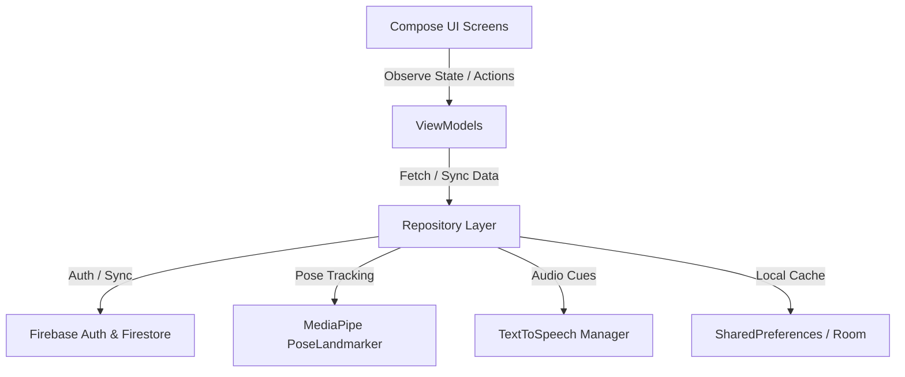
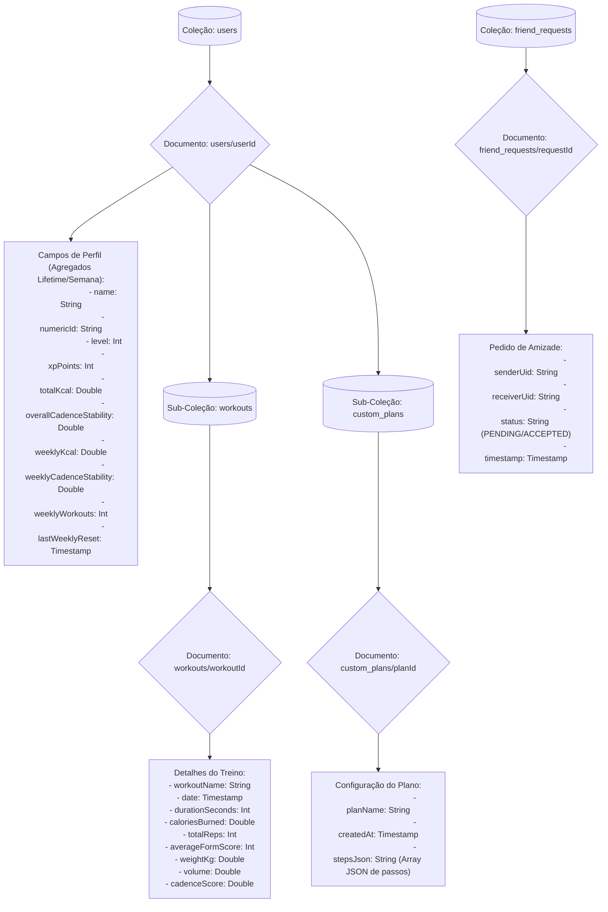
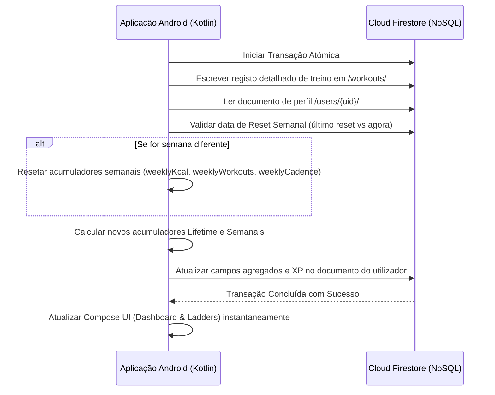

# Roadmap do Projeto: Aplicação AI Fitness Tracker (MVP)

Este roadmap detalha a arquitetura do sistema, o design da base de dados e os modelos algorítmicos do Fitness Tracker gamificado e impulsionado por AI.

---

##  Arquitetura do Sistema (MVVM)

A aplicação utiliza uma arquitetura Android limpa e moderna que segue o padrão **MVVM (Model-View-ViewModel)**, construída inteiramente com **Jetpack Compose**. 



---

##  Marcos de Implementação (Milestones)

###  Milestone 1: Autenticação de Utilizadores & Cloud Database (Firebase) ✅
O Firebase integra as contas de utilizador, personalização de perfil e persistência de dados na cloud em tempo real.

#### 1. Configuração de Firebase Authentication ✅
*   **Providers**: Ativar **Email/Password** e **Google Sign-In** na Consola Firebase.
*   **Fluxo do Utilizador**:
    1.  **Landing Screen**: Apresenta campos de texto para Email e Password. 
    2.  **Ação de Login**: Despoleta `FirebaseAuth.signInWithEmailAndPassword`. Em caso de sucesso, navega para a `DashboardActivity`.
    3.  **Registo**: Encaminha os utilizadores para uma nova `RegisterActivity` para efetuar o registo.

#### 2. Esquema Cloud Firestore e Hierarquia NoSQL ✅
O Cloud Firestore utiliza uma estrutura NoSQL hierárquica baseada em Coleções (pastas) e Documentos (ficheiros JSON). As coleções `workouts` (histórico de treinos) e `custom_plans` (planos criados pelo utilizador) são subcoleções aninhadas sob o documento do respetivo utilizador. Isto isola os dados de cada atleta por razões de desempenho e privacidade.



Os perfis de utilizador, planos personalizados e histórico de treinos são sincronizados numa coleção principal `/users`:

##### `/users/{userId}` (User Profile Document)
```json
{
  "name": "Jane Doe",
  "numericId": "12345",
  "age": 25,
  "weightKg": 68.5,
  "heightCm": 172.0,
  "xpPoints": 1250,
  "level": 3,
  "totalKcal": 150.5,
  "totalReps": 240,
  "totalWorkouts": 12,
  "overallCadenceStability": 82.5,
  "weeklyKcal": 45.2,
  "weeklyCadenceStability": 79.8,
  "weeklyWorkouts": 3,
  "lastWeeklyReset": "2026-07-05T00:00:00Z",
  "createdAt": "2026-06-10T00:00:00Z"
}
```

##### `/users/{userId}/workouts/{workoutId}` (Workout Log Sub-collection)
```json
{
  "date": "2026-06-10T08:30:00Z",
  "workoutName": "Morning Wakeup Routine",
  "durationSeconds": 480,
  "caloriesBurned": 72.4,
  "totalReps": 35,
  "averageFormScore": 88,
  "weightKg": 0.0,
  "volume": 0.0,
  "cadenceScore": 85.0
}
```

##### `/users/{userId}/custom_plans/{planId}` (Custom Plan Sub-collection)
```json
{
  "planName": "My Strength Plan",
  "createdAt": "2026-07-05T15:00:00Z",
  "stepsJson": "[{\"type\":\"SQUAT\",\"value\":10},{\"type\":\"REST\",\"value\":30},{\"type\":\"PUSHUP\",\"value\":8}]"
}
```

#### 3. Estratégia de Agregação na Escrita (Write-Time Aggregation) ✅
Para manter a renderização de **Tabelas de Classificação (Leaderboards)** e dos **Gráficos de Progresso** rápidos ($O(1)$) e de baixo tráfego de rede, a aplicação atualiza atomicamente os agregados e o XP no documento do utilizador no exato momento em que um treino é submetido.



---

###  Milestone 2: Expansão da Biblioteca de Exercícios ✅
Exercícios suportados e a sua lógica geométrica usando 2D MediaPipe landmarks:

#### 1. Bicep Curl (Braço Único / Alternado) ✅
*   **Landmarks Principais**: Ombro (11/12), Cotovelo (13/14), Pulso (15/16).
*   **Ângulo Monitorizado**: Ângulo interno da articulação do cotovelo $\theta$.
*   **Lógica de Deteção**:
    *   **Posição Inicial (DOWN)**: Braço totalmente estendido ($\theta \ge 160^\circ$).
    *   **Posição Final (UP)**: Braço totalmente fletido ($\theta \le 45^\circ$).

#### 2. Jumping Jacks ✅
*   **Landmarks Principais**: Tornozelos Esquerdo/Direito (27/28), Ombros Esquerdo/Direito (11/12), Pulsos Esquerdo/Direito (15/16).
*   **Lógica de Deteção**:
    *   **Estado OUT (UP)**: A distância entre tornozelos é maior que a largura dos ombros ($D_{ankles} > 1.5 \times D_{shoulders}$) **E** as mãos estão levantadas acima do nível dos ombros.
    *   **Estado IN (DOWN)**: Os pés estão juntos ($D_{ankles} \approx D_{shoulders}$) **E** as mãos estão em baixo abaixo da anca.

#### 3. Overhead Shoulder Press ✅
*   **Landmarks Principais**: Ombro (11/12), Cotovelo (13/14), Pulso (15/16).
*   **Lógica de Deteção**:
    *   **Posição Inicial (DOWN)**: Cotovelos dobrados, mãos à altura dos ombros ($\theta \le 90^\circ$).
    *   **Posição Final (UP)**: Braços estendidos retos acima da cabeça ($\theta \ge 165^\circ$).

#### 4. Mountain Climbers ✅
*   **Landmarks Principais**: Ombro (11/12), Anca (23/24), Joelho (25/26), Tornozelo (27/28).
*   **Lógica de Deteção**:
    *   O utilizador mantém uma posição estável de Plank. Um ângulo alternado de flexão do joelho $\le 70^\circ$ regista uma repetição.

---

###  Milestone 3: AI-Driven Scoring & Feedback de Áudio ✅
Este módulo analisa a qualidade do movimento em tempo real, fornecendo orientação visual e auditiva.

#### 1. Métrica de Form Scoring ✅
Um score ponderado de 0 a 100 é calculado para cada repetição:
*   **Range of Motion (ROM)** (até −40 pts): Verifica se a articulação atinge os ângulos alvo de flexão/extensão.
*   **Tempo Excêntrico** (até −30 pts): Penaliza uma descida demasiado rápida (sem controlo) ou demasiado lenta.
*   **Tempo Concêntrico** (até −25 pts): Penaliza o uso de balanço no levantamento.

#### 2. Text-to-Speech (TTS) Engine ✅
Utiliza o `TextToSpeech` nativo do Android em Português (`pt-PT`) com um debounce de 0.5 segundos para anunciar instruções:
*   *Correções de Postura*: "Desce mais!", "Sobe com controlo!", "Mais lento a descer!"

---

###  Milestone 4: Gamificação & Analytics ✅

A gamificação da experiência de fitness ajuda os utilizadores a manterem a consistência.

#### 1. Fórmula de Kcal / Gasto Energético ✅
Calculado usando a fórmula Metabolic Equivalent of Task (MET):
$$\text{Kcal Burned} = \text{MET} \times 3.5 \times \frac{\text{Weight (kg)}}{200} \times \text{Duration (minutes)}$$

*   *Exercícios Vigorosos (Push-up, Squat, Lunge)*: **8.0 MET** (O Mini Plan utiliza uma média de **6.0 MET**)
*   *Exercícios Moderados/Core (Plank)*: **4.0 MET**
*   *Descanso / Pausa*: **1.3 MET**

#### 2. Gráficos de Progresso ✅
Desenha os históricos semanais de treinos diretamente num gráfico de barras customizado em Jetpack Compose `Canvas`.
