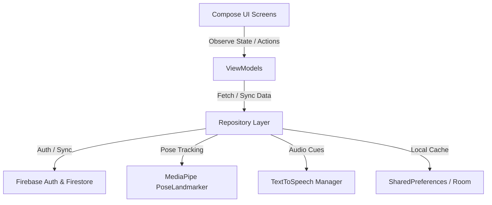

# Project Roadmap: AI Fitness Tracker App (MVP)

This roadmap details the system architecture, database design, and algorithmic models of the gamified, AI-driven fitness tracker.

---

## 🏗️ System Architecture (MVVM)

The application utilizes a clean, modern Android architecture following **MVVM (Model-View-ViewModel)** built entirely with **Jetpack Compose**. 



---

## 🎯 Implementation Milestones

### 📍 Milestone 1: User Authentication & Cloud Database (Firebase) ✅
Firebase integrates user accounts, profile personalization, and real-time cloud data persistence.

#### 1. Firebase Authentication Setup ✅
*   **Providers**: Enable **Email/Password** and **Google Sign-In** in the Firebase Console.
*   **User Flow**:
    1.  **Landing Screen**: Features text inputs for Email & Password. 
    2.  **Login Action**: Triggers `FirebaseAuth.signInWithEmailAndPassword`. Upon success, navigates to the `DashboardActivity`.
    3.  **Registration**: Directs users to a new `RegisterActivity` to register.

#### 2. Cloud Firestore Schema ✅
User profiles, custom plans, and workout history are synced under a `/users` root collection:

##### `/users/{userId}` (User Profile Document)
```json
{
  "name": "Jane Doe",
  "numericId": "12345",
  "age": 25,
  "weightKg": 68.5,
  "heightCm": 172.0,
  "xpPoints": 1250,
  "level": 3,
  "totalKcal": 150.5,
  "totalReps": 240,
  "totalWorkouts": 12,
  "overallCadenceStability": 82.5,
  "weeklyKcal": 45.2,
  "weeklyCadenceStability": 79.8,
  "weeklyWorkouts": 3,
  "lastWeeklyReset": "2026-07-05T00:00:00Z",
  "createdAt": "2026-06-10T00:00:00Z"
}
```

##### `/users/{userId}/workouts/{workoutId}` (Workout Log Sub-collection)
```json
{
  "date": "2026-06-10T08:30:00Z",
  "workoutName": "Morning Wakeup Routine",
  "durationSeconds": 480,
  "caloriesBurned": 72.4,
  "totalReps": 35,
  "averageFormScore": 88,
  "weightKg": 0.0,
  "volume": 0.0,
  "cadenceScore": 85.0
}
```

##### `/users/{userId}/custom_plans/{planId}` (Custom Plan Sub-collection)
```json
{
  "planName": "My Strength Plan",
  "createdAt": "2026-07-05T15:00:00Z",
  "stepsJson": "[{\"type\":\"SQUAT\",\"value\":10},{\"type\":\"REST\",\"value\":30},{\"type\":\"PUSHUP\",\"value\":8}]"
}
```

---

### 📍 Milestone 2: Expanding the Exercise Library ✅
Supported exercises and their geometric logic using 2D MediaPipe landmarks:

#### 1. Bicep Curl (Single Arm / Alternating) ✅
*   **Key Landmarks**: Shoulder (11/12), Elbow (13/14), Wrist (15/16).
*   **Angle Monitored**: Inner elbow joint angle $\theta$.
*   **Detection Logic**:
    *   **Starting Position (DOWN)**: Arm fully extended ($\theta \ge 160^\circ$).
    *   **Finishing Position (UP)**: Arm fully flexed ($\theta \le 45^\circ$).

#### 2. Jumping Jacks ✅
*   **Key Landmarks**: Left/Right Ankles (27/28), Left/Right Shoulders (11/12), Left/Right Wrists (15/16).
*   **Detection Logic**:
    *   **State OUT (UP)**: Ankle distance is wider than shoulder width ($D_{ankles} > 1.5 \times D_{shoulders}$) **AND** hands are raised above shoulder level.
    *   **State IN (DOWN)**: Feet are closed ($D_{ankles} \approx D_{shoulders}$) **AND** hands are down below hips.

#### 3. Overhead Shoulder Press ✅
*   **Key Landmarks**: Shoulder (11/12), Elbow (13/14), Wrist (15/16).
*   **Detection Logic**:
    *   **Starting Position (DOWN)**: Elbows bent, hands at shoulder height ($\theta \le 90^\circ$).
    *   **Finishing Position (UP)**: Arms extended straight overhead ($\theta \ge 165^\circ$).

#### 4. Mountain Climbers ✅
*   **Key Landmarks**: Shoulder (11/12), Hip (23/24), Knee (25/26), Ankle (27/28).
*   **Detection Logic**:
    *   User holds a stable plank position. Alternating knee flexion angle $\le 70^\circ$ registers a repetition.

---

### 📍 Milestone 3: AI-Driven Scoring & Audio Feedback ✅
This module analyzes movement quality in real-time, providing both visual and auditory guidance.

#### 1. Form Scoring Metric ✅
A weighted score from 0 to 100 is computed for each repetition:
*   **Range of Motion (ROM)** (up to −40 pts): Checks if the joint reaches the target flex/extension angles.
*   **Eccentric tempo** (up to −30 pts): Penalizes lowering too fast (no control) or too slow.
*   **Concentric tempo** (up to −25 pts): Penalizes using momentum on the lift.

#### 2. Text-to-Speech (TTS) Engine ✅
Uses Android's native `TextToSpeech` in Portuguese (`pt-PT`) with a 0.5-second debounce to announce cues:
*   *Form Corrections*: "Desce mais!", "Sobe com controlo!", "Mais lento a descer!"

---

### 📍 Milestone 4: Gamification & Analytics ✅

Gamifying the fitness experience helps users maintain consistency.

#### 1. Kcal/Energy Expenditure Formula ✅
Calculated using the Metabolic Equivalent of Task (MET) formula:
$$\text{Kcal Burned} = \text{MET} \times 3.5 \times \frac{\text{Weight (kg)}}{200} \times \text{Duration (minutes)}$$

*   *Vigorous exercises (Push-up, Squat, Lunge)*: **8.0 MET** (Mini Plan uses average **6.0 MET**)
*   *Moderate/Core exercises (Plank)*: **4.0 MET**
*   *Rest / Break*: **1.3 MET**

#### 2. Progress Charts ✅
Draws weekly workout histories directly onto a custom Jetpack Compose `Canvas` bar chart.

---

## ✅ Development Log

### 2026-07-05 — Usability Refinements & Custom Plan Creator
*   **Custom Plan Creator (`CreatePlanActivity.kt`)**: Added Compose plan builder enforcing rest steps ($\ge 30$ seconds) in between exercises. Validates range bounds: Squat (5-25 reps), Push-Up (3-15 reps), Lunge (5-20 reps per leg), and Rest (30-120s).
*   **Disclaimer Dialog (`StartPlanActivity.kt`)**: Added popup advising a phone calibration distance of 2 to 6 meters with full body in frame.
*   **Active Leg Cues (`LungeExercise.kt`)**: Prepends active leg (`Perna Esquerda: ` / `Perna Direita: `) to lunge cues.
*   **TTS Voice Debounce (`TTSHelper.kt`)**: Configured native Portuguese locale (`pt-PT`) and implemented a 0.5s debounce handler to prevent overlapping postural speech cues.
*   **Overlay HUD Size (`OverlayView.kt`)**: Boosted the HUD text sizes (Reps number is now $110\text{f}$) for distance viewing.
*   **Stylized App Icon**: Custom white dumbbell vector icon rotated 45 degrees over a black background with grid lines, scaled down to 65% size.
*   **Database Model Documentation**: Created `02_Desenho/BaseDados_Model.md` detailing the Firestore database schema.

### 2026-07-04 — NoSQL Write-Time Aggregation & Leaderboards
*   **Write-Time Client Aggregation (`MainActivity.kt`)**: Expanded completed workout transaction to calculate and save volume, cadence stability, and update lifetime/weekly aggregates atomically on a calendar-week boundary.
*   **Workout Detail Dialog (`ViewStatisticsActivity.kt`)**: Upgraded history cards to open detailed stats: duration, kcal, average score, volume, stability, concentric/eccentric tempos, and standard deviations.
*   **Competitive Ladders (`ViewStatisticsActivity.kt`)**: Integrated leaderboards displaying the top 10 users ranked by XP, Kcal, or Cadence Stability.

### 2026-07-01 — Delivery Restructuring & LaTeX Drafting
*   **Root Folder Structure**: Created standard project delivery folders: `00_Planeamento`, `01_Analise`, `02_Desenho`, `03_Implementacao`, `04_Teste`, and `_RELATORIO`.
*   **Root Index**: Created `_README.TXT` (Root directory descriptions) and `prompt_set.TXT` (cataloging prompts used).
*   **LaTeX Report**: Prepared all drafts of the LaTeX report in `_RELATORIO/overleaf/`.

### 2026-06-16 — Audio Guidance Cues (Text-To-Speech)
*   **Coaching Assistant (`TTSHelper.kt`)**: Implemented native Android `TextToSpeech` integration.
*   **Calibration UI Alert (`OverlayView.kt`)**: Added notice advising audio guidance during startup calibration.

### 2026-06-15 — Workout Plan Integration & Statistics Dashboard
*   **Guided Plan Execution (`StartPlanActivity.kt`)**: Guides the user through a Squat-Rest-Lunge mini plan.
*   **Performance Statistics (`ViewStatisticsActivity.kt`)**: Animated statistics screen with custom Canvas chart.
*   **Developer Diagnostics**: Added mock data seeding.

### 2026-06-12 — Real-Time Exercise Evaluation Engine
*   **`logic/RepPhaseTracker.kt`**: State machine (`AT_TOP → DESCENDING → ASCENDING`) timing eccentric/concentric phases.
*   **`logic/FormEvaluator.kt`**: Produces 0–100 form scores plus cues.
