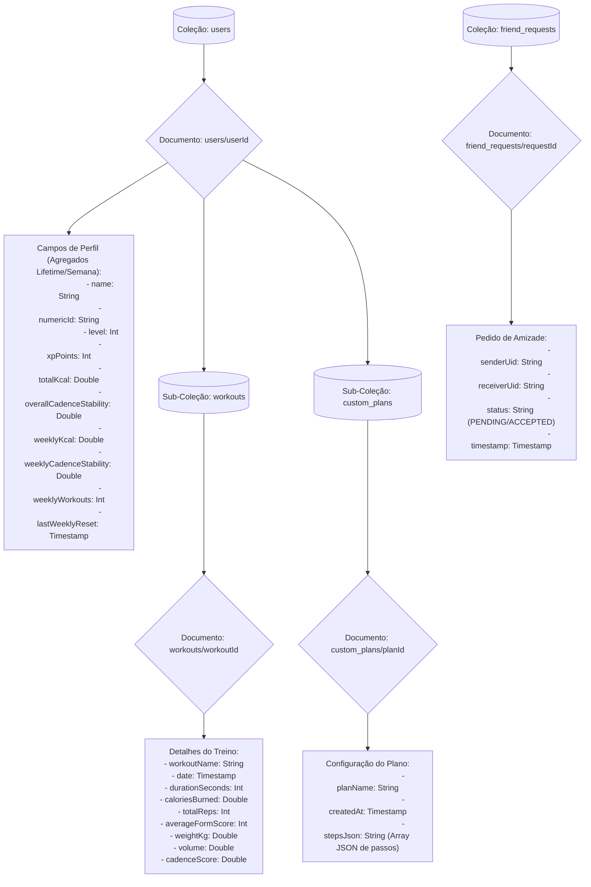
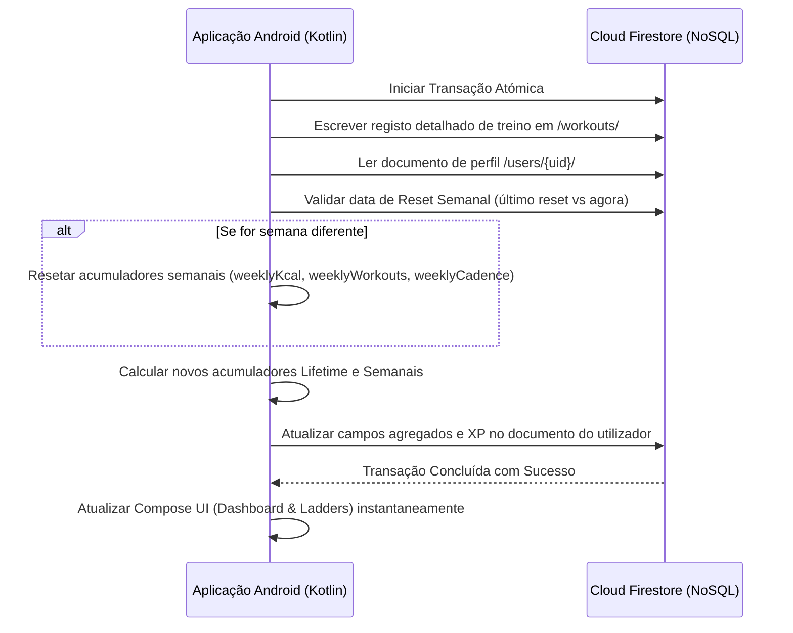

# Modelo e Estrutura da Base de Dados (Cloud Firestore NoSQL)

Este documento resume a organização dos dados no Cloud Firestore para a aplicação Fitness Tracker, suportando a sincronização em tempo real e a estratégia de agregação na escrita (*Write-Time Aggregation*).

---

##  Estrutura e Hierarquia da Base de Dados

O Cloud Firestore utiliza uma estrutura NoSQL hierárquica baseada em Coleções (pastas) e Documentos (ficheiros JSON). As coleções `workouts` (histórico de treinos) e `custom_plans` (planos criados pelo utilizador) são subcoleções aninhadas sob o documento do respetivo utilizador. Isto isola os dados de cada atleta por razões de desempenho e privacidade.

---

##  Estratégia de Agregação na Escrita (Write-Time Aggregation)

Para manter a renderização de **Tabelas de Classificação (Leaderboards)** e dos **Gráficos de Progresso** rápidos ($O(1)$) e de baixo tráfego de rede, a aplicação atualiza atomicamente os agregados e o XP no documento do utilizador no exato momento em que um treino é submetido.

---

##  Instruções para Limpeza Manual de Dados (Ambiente de Testes)

Durante os ensaios de usabilidade com os utilizadores, para limpar dados antigos mantendo apenas os treinos efetuados no dia de hoje:
1. Aceda à consola do **Firebase Console** e clique em **Firestore Database**.
2. Abra a coleção `users` e procure o ID do seu utilizador.
3. Entre na subcoleção **`workouts`**.
4. Apague os documentos cujo campo `date` seja anterior ao dia de hoje.
