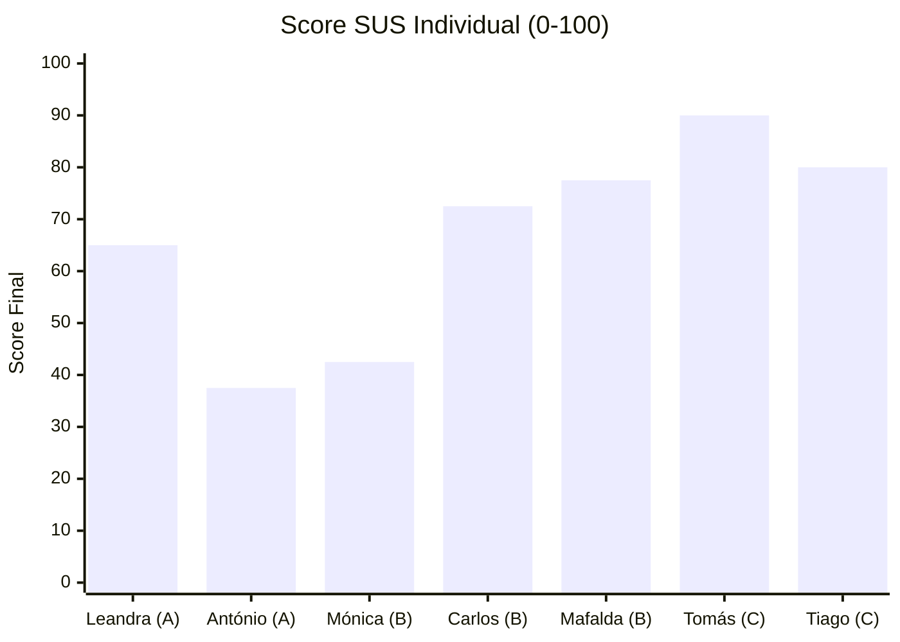
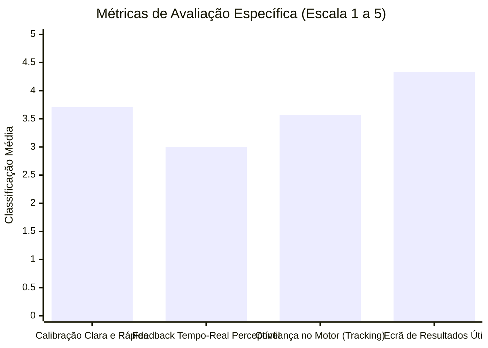

# Resultados dos Testes de Usabilidade — Fitness Tracker

Este documento regista as métricas, observações e análises extraídas das sessões de testes de usabilidade realizadas com utilizadores reais. O objetivo principal consistiu em validar a autonomia dos utilizadores na interface e a eficácia do algoritmo de visão por computador baseado em ângulos (BlazePose MediaPipe).

---

## 1. Quadro de Segmentação por Perfis (Personas)

Para garantir a representatividade dos testes, os 7 participantes foram mapeados em 3 grupos distintos de acordo com a sua literacia tecnológica e facilidade de interação com sistemas digitais. Para esta segmentação consideramos apenas conhecimentos relativos ao uso de dispositivos móveis e não conhecimentos da área da 'motricidade e fitness'.

| Grupo de Literacia | Participante | Idade | Foco Principal do Teste |
| :--- | :--- | :---: | :--- |
| **Grupo A: Literacia Baixa** *(Apenas conhecimentos simples de uso de telemóvel, geralmente necessitam apoio para usos menos convencionais fora de chamadas e mensagens)* | **Leandra** **António** | 28 26 | Validação Modelo Avaliação exercício, dependência de assistência para iniciar e desenho aplicação. |
| **Grupo B: Literacia Média** *(Utilizadores comuns de smartphone, utilização banal de smartphones e outras tarefas simples como conectar telemóvel a um dispositivo bluetooth)* | **Mónica** **Carlos** **Mafalda** | 55 58 27 | Validação Modelo Avaliação exercício, dependência de assistência para iniciar. |
| **Grupo C: Literacia Avançada** *(Área profissional tecnológica, ou similar. Conhecimentos de programação ou similar. Utilizador frequente de aplicações variadas para diversas necessidades.)* | **Tomás** **Tiago** | 22 25 | Validação Modelo Avaliação exercício, dependência de assistência para iniciar e desenho aplicação. Limites da avaliação / classificação. |

---

## 2. Diário de Bordo e Anotações das Sessões (Recolha Direta)

Anotações brutas registadas em tempo real pelo observador durante a execução dos testes.

### Sessão 01: Leandra
* **Ficha de Metadados:** Data: 04/07/2026 | Dispositivo: Próprio | Distância: 3m | Iluminação: Artificial (sala fechada com luzes) | Outros: Sala ampla, calças contrastantes.
* **Fase 0 (Autonomia):** Login hesitante devido aos termos em inglês; precisou de 1 pista para avançar no menu. Botão de início encontrado após exploração rápida.
* **Fase 1 (Protocolo & Ângulos):** Deteção inicial demorada (corpo de perfil). Squats: Correta. Lunges: Falhou 1 contagem (não detetou flexão do joelho traseiro). Push-ups: Correta.
* **Fase 2 (Entrevista Qualitativa):**
  * *P1 (Confusão inicial):* Sentiu hesitação com o inglês no login.
  * *P2 (Ritmo/Amplitude):* Adaptou inicialmente; depois correu fluido.
  * *P3 (Posicionamento/Luz):* Sem problemas de luz; distância fácil.
  * *P4 (Falhas específicas):* Notou atraso no feedback visual e sonoro nos afundos (lunges).

### Sessão 02: António
* **Ficha de Metadados:** Data: 04/07/2026 | Dispositivo: Observador | Distância: 3m | Iluminação: Natural (Sala com janela aberta, não na linha de visão da câmara) | Outros: Calças contrastantes.
* **Fase 0 (Autonomia):** Errou a password duas vezes; bloqueou no jargão técnico do menu inicial. Precisou de ajuda direta para iniciar o treino.
* **Fase 1 (Protocolo & Ângulos):** Deteção inicial falhou (exigiu reposicionar candeeiro). Squats: Correta (contou as 5). Lunges: Falhou contagem sistemática (contou apenas 2). Push-ups: Correta.
* **Fase 2 (Entrevista Qualitativa):**
  * *P1 (Confusão inicial):* Fluxo inicial confuso e muito técnico.
  * *P2 (Ritmo/Amplitude):* Teve de exagerar a descida e manter o corpo muito estático nos afundos para que a app registasse.
  * *P3 (Posicionamento/Luz):* Muito difícil enquadrar num quarto pequeno.
  * *P4 (Falhas específicas):* Os afundos (lunges) falharam de forma sistemática por oclusão da perna traseira.

### Sessão 03: Mónica
* **Ficha de Metadados:** Data: 11/07/2026 | Dispositivo: Observador | Distância: 3m | Iluminação: Natural (Janela de fundo em ligeira contra-luz) | Outros: Roupa escura.
* **Fase 0 (Autonomia):** Login fluido (reconheceu os campos básicos). Hesitou no menu ao procurar os exercícios livres.
* **Fase 1 (Protocolo & Ângulos):** Deteção inicial demorada devido ao forte contraste da janela. Squats: Correta. Lunges: Falhou contagem (perda de tracking de um dos joelhos devido à ligeira contra-luz). Push-ups: Correta.
* **Fase 2 (Entrevista Qualitativa):**
  * *P1 (Confusão inicial):* Entrou bem, mas o menu podia ser mais simples.
  * *P2 (Ritmo/Amplitude):* Movimentos normais nos agachamentos e flexões; deparou-se com problemas apenas nos afundos.
  * *P3 (Posicionamento/Luz):* Janela atrás causou problemas no início para detetar a postura lateral do lunge.
  * *P4 (Falhas específicas):* A app não registou corretamente a contagem dos afundos alternados.

### Sessão 04: Carlos
* **Ficha de Metadados:** Data: 12/07/2026 | Dispositivo: Observador | Distância: 3m | Iluminação: Natural (Sala com janela aberta, não na linha de visão da câmara) | Outros: Sala Ampla.
* **Fase 0 (Autonomia):** Avançou sem apoio no login. Encontrou o botão de treino rapidamente através dos ícones visuais.
* **Fase 1 (Protocolo & Ângulos):** Deteção inicial imediata. Squats: Correta. Lunges: Falhou contagem (2 não registadas). Push-ups: Correta.
* **Fase 2 (Entrevista Qualitativa):**
  * *P1 (Confusão inicial):* Fluxo muito direto e sem erros.
  * *P2 (Ritmo/Amplitude):* Fez a descida do afundo mais curta e o algoritmo não validou a amplitude do joelho.
  * *P3 (Posicionamento/Luz):* Fácil de posicionar o telemóvel na sala.
  * *P4 (Falhas específicas):* Os afundos falharam por falta de amplitude profunda/exigência de ângulo restrito.

### Sessão 05: Mafalda
* **Ficha de Metadados:** Data: 12/07/2026 | Dispositivo: Próprio | Distância: 3m | Iluminação: Natural (Sala com janela aberta, não na linha de visão da câmara) | Outros: Sala Ampla.
* **Fase 0 (Autonomia):** Registo autónomo fluido. Encontrou o ecrã de treino de imediato e iniciou sem qualquer instrução.
* **Fase 1 (Protocolo & Ângulos):** Deteção imediata. Squats: Correta. Lunges: Correta (execução controlada de Pilates ajudou a manter os ângulos corretos). Push-ups: Correta.
* **Fase 2 (Entrevista Qualitativa):**
  * *P1 (Confusão inicial):* Sem qualquer confusão, interface limpa.
  * *P2 (Ritmo/Amplitude):* Execução controlada funcionou na perfeição.
  * *P3 (Posicionamento/Luz):* Enquadramento fácil à primeira.
  * *P4 (Falhas específicas):* Nada a apontar, contagem exata nos três exercícios.

### Sessão 06: Tomás
* **Ficha de Metadados:** Data: 12/07/2026 | Dispositivo: Próprio | Distância: 3m | Iluminação: Natural (Sala com janela aberta, não na linha de visão da câmara) | Outros: Sala Ampla, calções e t-shirt claras.
* **Fase 0 (Autonomia):** Fluxo imediato. Navegação intuitiva e instantânea pelas opções.
* **Fase 1 (Protocolo & Ângulos):** Deteção imediata. Squats: Correta. Lunges: Falsos positivos (contou repetições fantasma na transição/subida rápida). Push-ups: Correta.
* **Fase 2 (Entrevista Qualitativa):**
  * *P1 (Confusão inicial):* Super simples, padrão comum de apps de treino.
  * *P2 (Ritmo/Amplitude):* Execução rápida nos afundos gerou pequenos bugs visuais no esqueleto.
  * *P3 (Posicionamento/Luz):* Sem problemas encontrados.
  * *P4 (Falhas específicas):* Os afundos contaram repetições extra devido à velocidade em que mudava de perna.

### Sessão 07: Tiago
* **Ficha de Metadados:** Data: 12/07/2026 | Dispositivo: Observador | Distância: 3m | Iluminação: Natural (Sala com janela aberta, não na linha de visão da câmara) | Outros: Utilizador alto (+/- 1,90m), roupa escura.
* **Fase 0 (Autonomia):** Login rápido. Encontrou o botão de treino sem dificuldades.
* **Fase 1 (Protocolo & Ângulos):** Deteção demorada (dificuldade em enquadrar pés e cabeça em simultâneo de perfil). Squats: Correta. Lunges: Falhou contagem (instabilidade frequente na perna traseira). Push-ups: Correta.
* **Fase 2 (Entrevista Qualitativa):**
  * *P1 (Confusão inicial):* Fluxo inicial simples e direto.
  * *P2 (Ritmo/Amplitude):* Amplitude normal nos squats e push-ups, mas deteção instável nos lunges devido à distância.
  * *P3 (Posicionamento/Luz):* Muito difícil posicionar a câmara para cobrir a altura total.
  * *P4 (Falhas específicas):* Falhas de leitura recorrentes nos afundos (lunges).

---

## 3. Matriz de Respostas ao Questionário Completo (Métricas e Gráficos)

Em vez de recorrer a capturas de ecrã externas, os dados brutos recolhidos via *Google Forms* foram processados e estão renderizados abaixo através da biblioteca gráfica nativa do repositório (Mermaid.js).

### 3.1. Classificação SUS (System Usability Scale) por Participante

O questionário aplicou as 10 perguntas padrão do modelo SUS (escala Likert de 1 a 5). A fórmula foi aplicada para converter as respostas de cada participante num *Score* final de 0 a 100.
*Nota: A média global da aplicação fixou-se nos **66.42** ($M=66.42, SD=19.62$), um valor muito próximo da média global da indústria de software (68), demonstrando viabilidade do protótipo, mas expondo a necessidade de melhorias de acessibilidade.*

### 3.2. Métricas Específicas do Sistema (Média de Respostas 1 a 5)

Adicionalmente às perguntas standard do SUS, foram medidas 4 dimensões específicas da usabilidade geométrica da aplicação e clareza da interface.

### 3.3. Destaques Qualitativos (Síntese)
As respostas livres da componente qualitativa evidenciaram 3 grandes tendências que influenciaram as correções no código:
1. **Atropelamento do Áudio:** *"A voz fala muito rápido e confunde"*, *"A voz do telemóvel atropela-se muito"*.
2. **Barreira Linguística:** *"A aplicação tem partes em inglês e baralhou-me"*, *"Precisa de ter opção traduzida para português"*.
3. **Eficiência vs Ocasião:** *"o tracking tem um ligeiro delay mas é sólido"*, *"Gostei das cores e estilo da app"*.

---

## 4. Observações Gerais dos Resultados (Análise Consolidada)

### Interface e Usabilidade Geral (Fases 0 e 2)
* **Ausência de Localização (Idiomas):** A falta de um seletor PT/EN gerou entropia imediata no Grupo A (Leandra e António), causando hesitações no ecrã de registo.
* **Ritmo do Feedback por Áudio (Text-to-Speech):** O motor de voz revelou-se demasiado rápido. Em momentos de fadiga física ou acumulação rápida de repetições, as frases sobrepunham-se ("atropelavam-se"), penalizando a clareza do feedback (P12) nos Grupos A e B.

### Comportamento do Algoritmo e Ambiente (Fases 1 e 3)
* **Problema de Escala e Distância (Acessibilidade Visual):** À distância necessária para o BlazePose capturar o corpo inteiro (2.5m a 4.1m), o texto do ecrã ficou virtualmente ilegível para a maioria. Utilizadores quebraram a postura correta para tentar ler o progresso no visor.
* **Dificuldade de Posicionamento Autónomo (P15 e P16):** Utilizadores com maior estatura (Tiago) ou quartos com menos espaço (António e Mónica) sentiram grande complexidade em calibrar o ângulo ideal sem recorrer à ajuda de um terceiro.
* **Fidelidade da Contagem por Exercício:** 
  * **Squats e Push-ups:** Demonstraram excelente consistência em execuções normais e controladas. Nas flexões (Push-ups), o tracking no chão manteve-se bastante estável quando o utilizador estava bem posicionado, registando-se poucas quebras de leitura.
  * **Lunges:** **Apresentaram a maior taxa de erro e falhas do estudo.** Embora o tracking reconhecesse o esqueleto do corpo, a sobreposição visual de uma perna face à outra (oclusão natural do movimento lateral) confundiu os limites trigonométricos. O algoritmo provou ser demasiado sensível.
