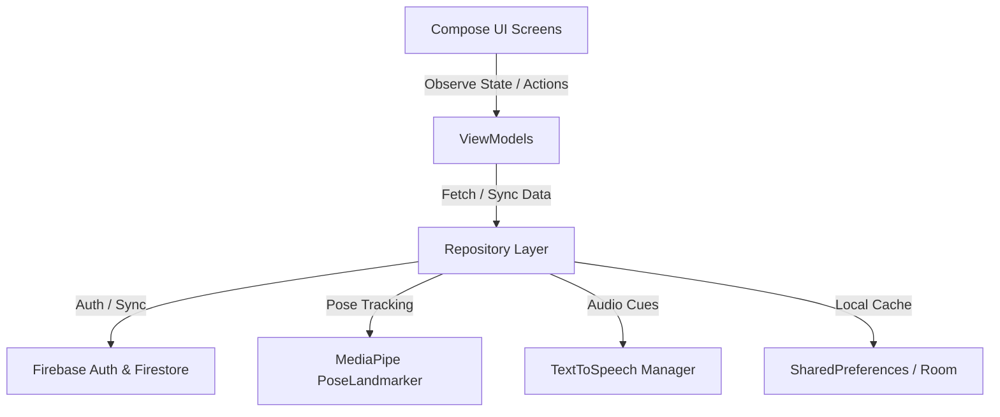

# Project Roadmap: AI Fitness Tracker App (MVP)

This roadmap details the system architecture, database design, and algorithmic models required to build a functional, gamified, AI-driven fitness tracker. This document is saved at the root of the project to serve as documentation for your final course project and GitHub repository.

---

## 🏗️ System Architecture (MVVM)

The application utilizes a clean, modern Android architecture following **MVVM (Model-View-ViewModel)** built entirely with **Jetpack Compose**. 



---

## 🎯 Implementation Milestones

### 📍 Milestone 1: User Authentication & Cloud Database (Firebase)
Instead of local-only storage, we will integrate Firebase to support user accounts, profile personalization, and cloud data persistence.

#### 1. Firebase Authentication Setup
*   **Providers**: Enable **Email/Password** and **Google Sign-In** in the Firebase Console.
*   **Dependencies to add (build.gradle.kts)**:
    ```kotlin
    implementation(platform(libs.firebase.bom))
    implementation(libs.firebase.auth)
    implementation(libs.play.services.auth)
    ```
*   **User Flow**:
    1.  **Landing Screen**: Features text inputs for Email & Password. 
    2.  **Login Action**: Triggers `FirebaseAuth.signInWithEmailAndPassword`. Upon success, navigates to the `DashboardActivity`.
    3.  **Registration Link**: Directs users to a new `RegisterActivity` (or Composable screen) to enter:
        *   Email, Password, Name, Age, Weight, and Height.
    4.  **Register Action**: Calls `FirebaseAuth.createUserWithEmailAndPassword`. Upon creation, saves the profile data to Cloud Firestore.

#### 2. Cloud Firestore Schema
User profiles and workout history will be synced under a `/users` root collection:

##### `/users/{userId}` (User Profile Document)
```json
{
  "name": "Jane Doe",
  "age": 25,
  "weightKg": 68.5,
  "heightCm": 172.0,
  "xpPoints": 1250,
  "level": 3,
  "createdAt": "2026-06-10T00:00:00Z"
}
```

##### `/users/{userId}/workouts/{workoutId}` (Workout Log Sub-collection)
```json
{
  "date": "2026-06-10T08:30:00Z",
  "workoutName": "Morning Wakeup Routine",
  "durationSeconds": 480,
  "caloriesBurned": 72.4,
  "totalReps": 35,
  "averageFormScore": 88
}
```

---

### 📍 Milestone 2: Expanding the Exercise Library
To offer rich, customizable training plans, we will expand our AI-tracking model to support a wider array of exercises. Below is the geometric logic to detect and count reps for these new routines using 2D MediaPipe landmarks:

#### 1. Bicep Curl (Single Arm / Alternating)
*   **Key Landmarks**: Shoulder (11 or 12), Elbow (13 or 14), Wrist (15 or 16).
*   **Angle Monitored**: Inner elbow joint angle $\theta$.
*   **Detection Logic**:
    *   **Starting Position (DOWN)**: Arm fully extended ($\theta \ge 160^\circ$).
    *   **Finishing Position (UP)**: Arm fully flexed ($\theta \le 45^\circ$).
    *   **Repetition Count**: Increment when the arm cycles from `DOWN` $\to$ `UP` $\to$ `DOWN`.

#### 2. Jumping Jacks
*   **Key Landmarks**: Left Ankle (27), Right Ankle (28), Left Shoulder (11), Right Shoulder (12), Left Wrist (15), Right Wrist (16).
*   **Metrics Monitored**: 
    1. Distance between Ankles ($D_{ankles}$).
    2. Vertical Position of Wrists relative to Shoulders ($Y_{wrists} < Y_{shoulders}$).
*   **Detection Logic**:
    *   **State OUT (UP)**: Ankle distance is wider than shoulder width ($D_{ankles} > 1.5 \times D_{shoulders}$) **AND** hands are raised above shoulder level.
    *   **State IN (DOWN)**: Feet are closed ($D_{ankles} \approx D_{shoulders}$) **AND** hands are down below hips.
    *   **Repetition Count**: Increment when returning to `IN` state after reaching `OUT` state.

#### 3. Overhead Shoulder Press
*   **Key Landmarks**: Shoulder (11/12), Elbow (13/14), Wrist (15/16).
*   **Angle Monitored**: Elbow joint angle $\theta$ and vertical relative position of wrists.
*   **Detection Logic**:
    *   **Starting Position (DOWN)**: Elbows bent, hands at shoulder height ($\theta \le 90^\circ$).
    *   **Finishing Position (UP)**: Arms extended straight overhead ($\theta \ge 165^\circ$).
    *   **Repetition Count**: Increment on returning to `DOWN` position.

#### 4. Mountain Climbers
*   **Key Landmarks**: Shoulder (11/12), Hip (23/24), Knee (25/26), Ankle (27/28).
*   **Metrics Monitored**: Alternating knee-to-hip distance / knee flexion angle.
*   **Detection Logic**:
    *   User holds a stable plank position (shoulders-hips-ankles $\approx 180^\circ$).
    *   **Left Knee Tuck**: Left knee moves forward under chest (knee angle $\le 70^\circ$).
    *   **Right Knee Tuck**: Right knee moves forward under chest (knee angle $\le 70^\circ$).
    *   **Repetition Count**: Increment on every completed alternating tuck.

---

### 📍 Milestone 3: AI-Driven Scoring & Audio Feedback ✅ *(Form Scoring implemented — see Development Log below)*
This module analyzes movement quality in real-time, providing both visual and auditory guidance.

#### 1. Form Scoring Metric ✅
A weighted score from 0 to 100 is computed for each repetition:
*   **Range of Motion (ROM)** (up to −40 pts): Checks if the joint reaches the target flex/extension angles.
*   **Eccentric tempo** (up to −30 pts): Penalizes lowering too fast (no control) or too slow.
*   **Concentric tempo** (up to −25 pts): Penalizes using momentum on the lift.

#### 2. Text-to-Speech (TTS) Engine
Uses Android's native `TextToSpeech` to announce cues:
*   *Form Corrections*: "Keep your hips straight!", "Lower your chest!", "Go deeper!"
*   *Pacing & Motivation*: "Nice rep!", "Perfect form!", "Three more left!"

---

### 📍 Milestone 4: Gamification & Analytics
Gamifying the fitness experience helps users maintain consistency.

#### 1. Kcal/Energy Expenditure Formula
Calculated using the Metabolic Equivalent of Task (MET) formula:
$$\text{Kcal Burned} = \text{MET} \times 3.5 \times \frac{\text{Weight (kg)}}{200} \times \text{Duration (minutes)}$$

*   *Vigorous exercises (Push-up, Squat, Lunge, Press)*: **8.0 MET**
*   *Moderate/Core exercises (Plank, Mountain Climber)*: **4.0 MET**
*   *Rest / Break*: **1.3 MET**

#### 2. Progress Charts
Draws weekly workout histories directly onto a custom Jetpack Compose `Canvas` element, ensuring a highly responsive UI with zero heavy external graphing dependencies.

---

## ✅ Development Log

### 2026-06-12 — Real-Time Exercise Evaluation Engine
Implements the core of Milestone 3 (Form Scoring): every repetition is now timed, measured against reference angles, and scored.

*   **`logic/RepMetrics.kt`** — per-rep data model: eccentric/concentric duration (ms), min/max joint angle (ROM), form score (0–100), and correction cues.
*   **`logic/ExerciseConfig.kt`** — per-exercise reference values: ideal bottom/top angles (with tolerance) and recommended tempo ranges for each phase.
*   **`logic/RepPhaseTracker.kt`** — state machine (`AT_TOP → DESCENDING → ASCENDING`) that times the **eccentric** (lowering) and **concentric** (lifting) phases from the live joint angle and captures the real range of motion. Partial reps (returning up without reaching depth) are discarded.
*   **`logic/FormEvaluator.kt`** — compares each completed rep against the `ExerciseConfig` reference and produces the 0–100 score plus actionable feedback ("Go deeper", "Lower more slowly", "Avoid momentum").
*   **`Exercise` interface** — extended with `repHistory`, `lastRepMetrics`, `lastRepScore` (defaults keep Plank/Rest untouched).
*   **Push-Up / Squat / Lunge** — migrated from the simple UP/DOWN flag to the phase tracker + evaluator; reference angles preserved (70°/150° push-up, 70°/160° squat, 80°/160° lunge back knee).

### 2026-06-12 — "Test Exercises" Section & Guided Session Flow
A new dashboard section with one card per exercise (Push-Up, Squat, Lunge, Plank), each launching a guided single-exercise session.

*   **`ExerciseTestActivity`** — one generic camera activity parametrized by `EXERCISE_TYPE` (no duplicated camera pipeline). Session state machine:
    1.  **WAITING** — the user gets into the exercise's start position and holds still ~1.5 s (auto-start; no touch or gesture needed). Each exercise defines `isInStartPosition()` (e.g. horizontal torso + extended elbows for push-up, standing + straight knees for squat/lunge) and `setupInstruction` with the camera-facing direction (side-on for push-up/squat/plank, front for lunge).
    2.  **COUNTDOWN** — 5 → 1 → **GO!** full-screen counter.
    3.  **EXERCISING** — counts **20 reps** (or **20 s** hold for the plank) with live form evaluation.
    4.  **FINISHED** — hands off to the results screen.
*   **`logic/StartPositionDetector.kt`** — auto-start trigger: in-position + body stillness (average torso/leg landmark movement below threshold) for 1.5 s fills a progress bar and starts the countdown.
*   **`PlankExercise`** — rewritten as time-based with an **accumulating** hold timer (brief posture breaks pause instead of resetting), plus `isTimeBased`/`progress()` support.
*   **`ResultActivity`** — post-exercise summary in Jetpack Compose matching the app theme: score/completion ring, stat cards (reps, best rep, avg lowering/lifting tempo), and a per-rep form bar chart.
*   **`OverlayView`** — rewritten as a phase-aware HUD in the dark/neon aesthetic: top panel with name + progress bar, centered cue pill, bottom form-evaluation panel (color-coded by score), rounded skeleton rendering. The legacy `updateResults()` API is kept so `MainActivity`/`DemoPushUpActivity` still work.
*   **Robustness** — `PoseLandmarker` initialization wrapped in try/catch in all camera activities: on unsupported ABIs (e.g. x86_64 emulators — MediaPipe ships ARM-only native libs) the screen shows a toast and exits cleanly instead of crashing. **Pose features must be tested on a physical ARM device.**
