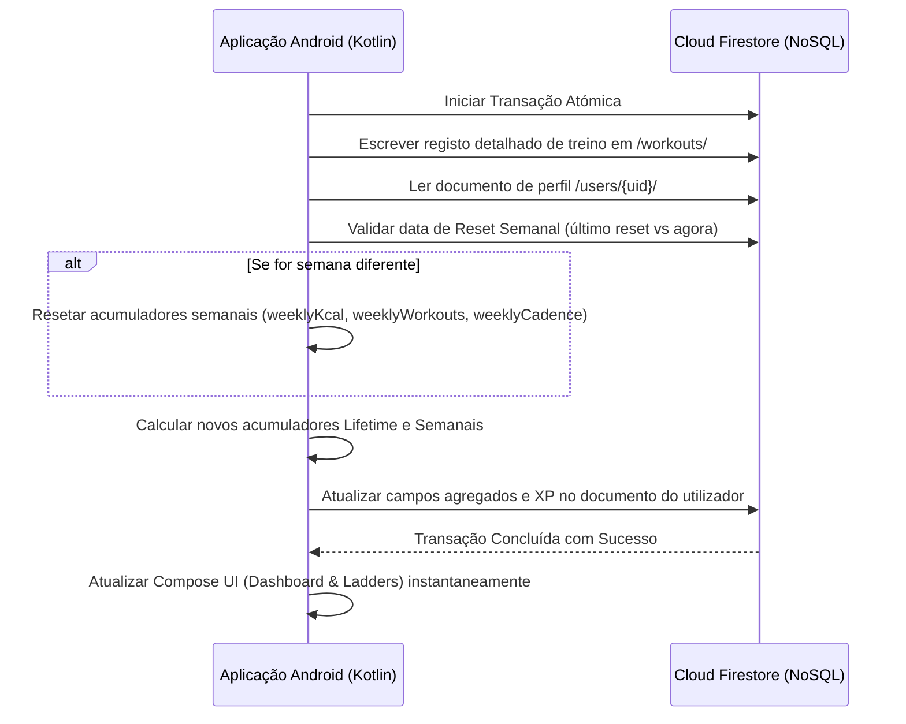

#  Síntese

**Data:** Maio 2026  
**Autores:** Rodrigo Correia (45155), David Delgado (51598)

---

**Fontes:**
- [Ollama GitHub](https://github.com/ollama/ollama)
- [Issue #4510 - Performance Android](https://github.com/ollama/ollama/issues/4510)
- [Google IDX Free Tier](https://idx.dev/docs)
- [LAMI Client - Exemplo Android](https://github.com/sonusid1325/ollama-android)

- [Google 'Académico'] (https://scholar.google.com/scholar?scilib=1&scioq=Mediapipe+android+lunges&hl=pt-PT&as_sdt=0,5)

---

## 

**Funcionalidades possiveis:**
1. Feedback textual personalizado após cada série 
2. Criação de treinos por comando de voz?
3. Resumo motivacional pós-treino
4. Análise de dados de treino, planeamento regime treino

5. Mas principalmente, é uma ferramenta boa para montar encima das features desenvolvidas 'core' do projeto. NÃO as substitui.
Ou seja, a app com recurso a internet tem funcionalidades extra, mas funcional sem a Mesma!??

** NÃO é possivel:**
- Feedback em tempo real via Ollama (MediaPipe no momento, Ollama por API calls)
- Correr Ollama locamente no telemóvel

---

## Fluxo da integração possivel
APLICAÇÃO ANDROID + MEDIAPIPE

 1. Utilizador completa série de 10 repetições

[MediaPipe] → deteta ângulos (joelho, anca) e ritmo

 2. Enviar dados para servidor Ollama

[App Android] → HTTP POST para http://<IP_SERVIDOR>:11434/api/generate
{
"model": "llama3.2:3b",
"prompt": "Ângulo joelho: 95°, ângulo anca: 130°, exercício: agachamento. Dá feedback de 1 frase."
}

 3. Servidor processa (2-5 segundos)

[Ollama na VM/PC] → gera resposta textual

 4. App recebe resposta

[App Android] → exibe feedback no ecrã durante pausa entre séries

 5. Guardar no histórico, mostrar texto ao utilizador

[Base de Dados] → armazena feedback com timestamp e série, apresenta feedback visual.

Para manter as consultas a tabelas de classificação (ladders) rápidas e baratas ($O(1)$) sem necessitar de processamento contínuo em servidor, implementámos uma estratégia de **Agregação na Escrita via Transação de Cliente NoSQL**:

#### Razão da Decisão (Estratégia de Agregação na Escrita NoSQL):
- **Otimização de Leituras**: Em bases NoSQL, leituras de agregação (como médias e somatórios históricos) são computacionalmente caras e lentas se feitas sob demanda. Armazenar a média corrente diretamente no documento do perfil permite exibir dados ao utilizador em tempo real com apenas uma leitura de documento.
- **Competição Escalável**: As tabelas de classificações (Ladders de XP, Kcal, Cadência) podem ordenar e limitar os utilizadores diretamente pelos campos pre-calculados, reduzindo o tráfego da rede para uma única chamada de consulta simples.

--

## Links da reunião 18 Junho

https://github.com/cmu-perceptual-computing-lab/openpose
 
https://dl.acm.org/doi/fullHtml/10.1145/3556223.3556260
 
https://github.com/Pushtogithub23/Tracking-Physical-Activities-with-MediaPipe-and-OpenCV
 
https://github.com/vinsouza99/BodyBuddy
 
https://dev.to/yoshan0921/fitness-app-development-with-real-time-posture-detection-using-mediapipe-38do
 
https://www.joiv.org/index.php/joiv/article/view/2993/1168
 
https://ieeexplore.ieee.org/abstract/document/11490277?casa_token=yK4YWTIYEXUAAAAA:Rk52TLD7l4a08ki5xjwNaSAAWBkdyLVhocgKFdqCiD7ixjTkbXFzB7Xao2AVg91m5e6TmMwcCQ
 
https://www.youtube.com/watch?v=mRXskYUXA-A

------------------------------------------------------------------------
## Fundamentação Biomecânica - Fontes de Referência Oficial
------------------------------------------------------------------------

Para garantir rigor académico, a nossa estimativa de pose e pontuação baseia-se em cruzamento analítico de três grandes fontes de autoridade:
1.  **ACSM (American College of Sports Medicine):** *Guidelines for Exercise Testing and Prescription* e *ACSM's Resources for the Personal Trainer*. Estabelece os protocolos padrão de endurance muscular, amplitudes de movimento clínicas e limites seguros.
2.  **NSCA (National Strength and Conditioning Association):** *Essentials of Strength Training and Conditioning*. Define a cinemática articular detalhada (ângulos ótimos, vetores de carga) e o alinhamento da coluna/tronco (Core stabilization).
3.  **FITescola / DGE (Direção-Geral da Educação, Portugal):** *Manual de Testes da Aptidão Física FITescola*. Serve como referência da Educação Física escolar em Portugal, regulando a execução de flexões e cadências com falha de forma.
4.  **ACE (American Council on Exercise):** *ACE Personal Trainer Manual*. Define os 5 movimentos fundamentais (agachar, afundar, empurrar, puxar, rodar) e os limites de estabilização isométrica.

Abaixo estão detalhados os parâmetros cinemáticos e landmarks (MediaPipe) para os 4 exercícios implementados e para os 4 planeados no roadmap:

### 1. Flexão de Braços (Push-Up) — [CORE]
*   **Protocolo:** Posição inicial de prancha frontal, braços esticados. Descida controlada até o peito aproximar-se do solo. Subida até à extensão de cotovelos sem hiperextensão.
*   **Articulação Chave:** Cotovelo (Ombro [11/12] - Cotovelo [13/14, vértice] - Pulso [15/16]).
*   **Ângulo DOWN (Flexão):** $\theta \le 70^\circ - 90^\circ$ (Upper arms parallel to floor).
*   **Ângulo UP (Extensão):** $\theta \ge 150^\circ$.
*   **Alinhamento da Coluna:** Ângulo Ombro-Anca-Tornozelo ideal $\approx 180^\circ \pm 15^\circ$ (evitar anca descaída ou elevada).
*   **Fontes de Validação:**
    *   *ACSM (Push-up Endurance Assessment):* Exige descida até ao contacto com o solo/ângulo reto no cotovelo.
    *   *FITescola:* Exige corpo alinhado em linha reta e descida até $90^\circ$ no cotovelo de forma contínua em cadência de sinal sonoro.

### 2. Agachamento (Squat) — [CORE]
*   **Protocolo:** Posição de pé, pés à largura dos ombros. Descer as ancas empurrando-as para trás, fletindo os joelhos. Subida completa empurrando contra o chão.
*   **Articulação Chave:** Joelho (Anca [23/24] - Joelho [25/26, vértice] - Tornozelo [27/28]).
*   **Ângulo DOWN (Flexão):** $\theta \le 70^\circ - 90^\circ$ (Thighs parallel to ground).
*   **Ângulo UP (Extensão):** $\theta \ge 150^\circ - 160^\circ$ (Standing).
*   **Alinhamento do Tronco:** Ângulo de inclinação do tronco (Ombro-Anca-Vertical) $\le 45^\circ$ para evitar sobrecarga lombar.
*   **Fontes de Validação:**
    *   *NSCA (Squat Biomechanics):* O agachamento paralelo/profundo atinge flexão de joelho de $70^\circ$ a $90^\circ$ e exige alinhamento patelar sem valgo (joelho para dentro).
    *   *ACE (Bend-and-Lift):* Enfatiza a anca como motor primário e joelho alinhado sobre o pé.

### 3. Afundo (Lunge) — [CORE]
*   **Protocolo:** Passo em frente longo. Descer a anca verticalmente até ambas as pernas desenharem ângulos retos. Retorno ao pé.
*   **Articulações Chaves:** Joelho Dianteiro e Joelho Traseiro.
*   **Ângulos de Flexão (DOWN):** Joelho Dianteiro $\le 80^\circ - 90^\circ$. Joelho Traseiro $\le 80^\circ - 90^\circ$ (a pairar acima do solo).
*   **Alinhamento do Tronco:** Tronco reto vertical (Anca-Ombro-Vertical $\le 15^\circ$).
*   **Fontes de Validação:**
    *   *NSCA (Unilateral lower body):* Estabilidade da anca horizontal e joelho da frente sem passar a linha dos dedos do pé.
    *   *ACE (Single-Leg Pattern):* Joelhos a $90^\circ$ de flexão sob vetor de gravidade direto.

### 4. Prancha (Plank) — [CORE]
*   **Protocolo:** Apoio nos antebraços e pés no chão. Corpo estático e rígido.
*   **Métrica Principal:** Alinhamento Ombro-Anca-Tornozelo (11/12, 23/24, 27/28).
*   **Limites de Postura:** $\theta \approx 180^\circ \pm 15^\circ$ (entre $165^\circ$ e $195^\circ$). Desvios fora disto sinalizam falha postural imediata.
*   **Fontes de Validação:**
    *   *NSCA & ACE (Isometric Core Assessment):* Avaliação da rigidez do core e prevenção de fadiga que resulte em cifose lombar ou hiperextensão da anca.

### 5. Flexão de Bíceps (Bicep Curl) — [ROADMAP]
*   **Protocolo:** Braço colado ao tronco. Flexão isolada do cotovelo sem balançar o ombro.
*   **Articulação Chave:** Cotovelo (Ombro [11/12] - Cotovelo [13/14, vértice] - Pulso [15/16]).
*   **Ângulo Inicial (DOWN):** $\theta \ge 160^\circ$ (braço estendido).
*   **Ângulo Final (UP):** $\theta \le 45^\circ$ (flexão máxima).
*   **Fontes de Validação:**
    *   *NSCA (Single-Joint arm kinetics):* Proíbe balanço da articulação glenoumeral (ombro), forçando a ativação do bícipete braquial.

### 6. Jumping Jacks — [ROADMAP]
*   **Protocolo:** Saltos coordenados laterais com abertura simultânea de membros.
*   **Métricas de Abertura (OUT):** Distância Tornozelo-Tornozelo (27 a 28) $> 1.5 \times$ largura de ombros AND mãos acima do ombro ($Y_{pulso} < Y_{ombro}$).
*   **Métricas de Fecho (IN):** Distância Tornozelo-Tornozelo $\approx$ largura de ombros AND mãos ao lado da anca.
*   **Fontes de Validação:**
    *   *ACSM (Cardiorespiratory warm-up):* Cadência rápida e simetria de membros para ativação neuromuscular.

### 7. Overhead Press — [ROADMAP]
*   **Protocolo:** Barra ou halteres à altura dos ombros. Empurrar verticalmente até esticar braços acima da cabeça.
*   **Articulação Chave:** Cotovelo e Ombros.
*   **Ângulo Inicial (DOWN):** Cotovelos dobrados a $\le 90^\circ$ junto aos ombros.
*   **Ângulo Final (UP):** Extensão total dos braços overhead (cotovelo $\ge 165^\circ$).
*   **Fontes de Validação:**
    *   *NSCA (Vertical Push):* Estabilidade da coluna (manter lordose fisiológica) e extensão bilateral simétrica.

### 8. Mountain Climbers — [ROADMAP]
*   **Protocolo:** Posição de prancha alta. Dobrar pernas alternadamente trazendo os joelhos em direção ao peito.
*   **Métricas Chaves:** Perna de apoio em prancha reta ($\theta \approx 180^\circ \pm 15^\circ$) AND perna ativa flete joelho (joelho $\le 70^\circ$ do quadril).
*   **Fontes de Validação:**
    *   *ACE (Dynamic Core Stabilization):* Resistência rotacional do tronco enquanto decorre a flexão rápida da anca.

 
