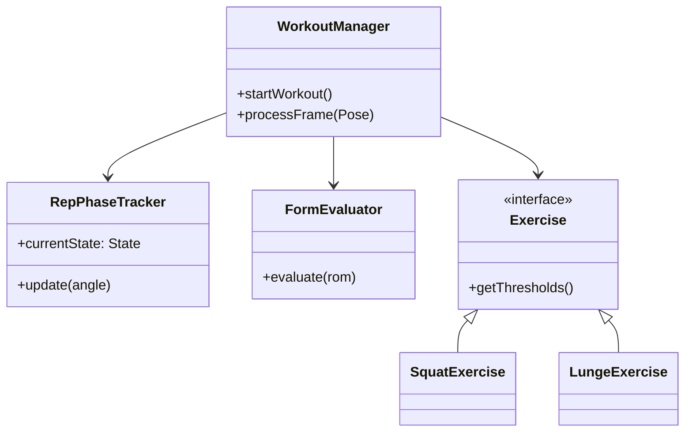
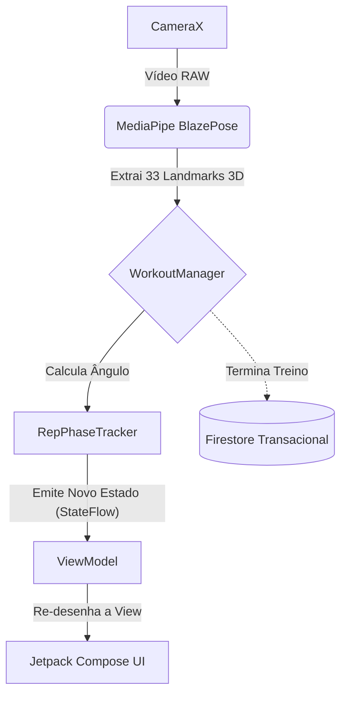
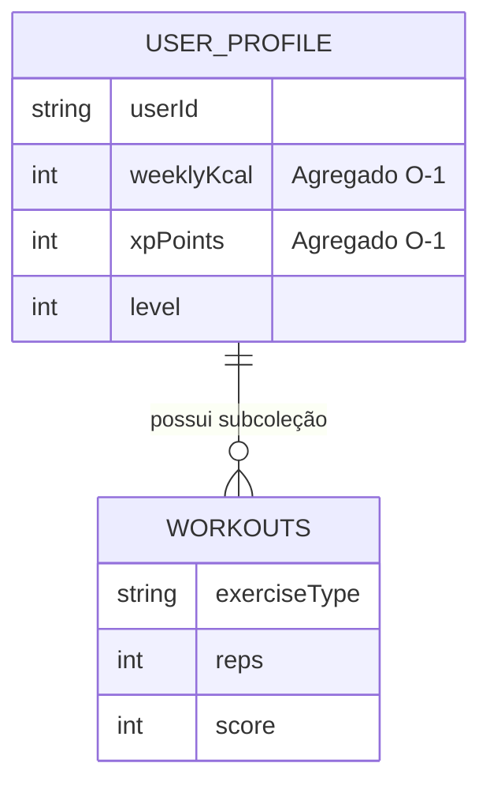

# Preparação Apresentação Final (Top-Down Completo)

Este é o documento de estudo exaustivo para a defesa do projeto **FitnessTracking**. Cobre desde as decisões de design embrionárias, passando pela Prova de Conceito em Python, até ao detalhe das implementações em Kotlin (packages e métodos), arquitetura Firestore, testes de usabilidade e restrições de Hardware.

---

## 1. Evolução Histórica e Decisões de *Design* Críticas

Durante as várias *sprints* deste projeto, tomámos decisões de simplificação e refatorização vitais para garantir a entrega de um produto estável:

1. **Abandono do Python e adoção de Kotlin Nativo:**
   A diretoria `03_Implementacao/POC_Python` foi o nosso "balão de ensaio". Usámos Python com MediaPipe para iterar rapidamente a matemática dos ângulos. Contudo, tentar correr código Python num ambiente de produção Android (através de *Chaquopy* ou REST APIs) iria introduzir latência inadmissível. Reescrevemos tudo do zero em Kotlin para injetar a lógica diretamente no *pipeline* da `CameraX`, resultando num motor *Edge Computing* puro.
2. **Bloqueio da Orientação do Ecrã (Portrait Lock):**
   Decidimos trancar a App na orientação vertical (Portrait). *Porquê?* Rastrear corpos em modo de paisagem (Landscape) alteraria a matriz de coordenadas `X, Y` do MediaPipe, forçando a matemática a fazer transposições vetoriais constantes. Para além disso, no telemóvel pousado no chão, o modo vertical abrange muito melhor a altura total do corpo humano.
3. **Debounce do TTS (Text-to-Speech):**
   Durante os testes, reparámos que a IA disparava conselhos corretivos muito rapidamente. Implementámos um *debounce* temporal de 500ms no `TTSHelper` para garantir que o motor de voz acabava de falar antes de emitir um novo alerta, resolvendo o problema de sobreposição acústica.

---

## 2. Estrutura de Código Kotlin (Mergulho Profundo)

A base de código em `AndroidApp_V_0.1/app/src/main/java/com/example/fitnesstrackerapp` foi dividida metodicamente. 

### 2.1. O *Package* `logic` (O "Cérebro" Biomecânico)
Este pacote não tem qualquer conhecimento de que existe uma Interface de Utilizador. É aqui que vive o motor:
*   **`AngleCalculator.kt`:** É a base cinesiológica. Recebe 3 *landmarks* do MediaPipe (ex: Anca, Joelho, Tornozelo), cria dois vetores e aplica-lhes a função trigonométrica Arco-cosseno ($\arccos$) combinada com o Produto Escalar. É independente da distância à câmara.
*   **`RepPhaseTracker.kt`:** Implementa a Máquina de Estados Finitos com 3 estados fixos (`AT_TOP`, `DESCENDING`, `ASCENDING`). Obriga a uma passagem sequencial rigorosa pelos três limiares (Extensão, Contagem, Ideal) para evitar *jitter* e contagens falsas.
*   **`FormEvaluator.kt`:** Trata do modelo de pontuação biomecânica (Scoring). Calcula uma penalização fracionária/proporcional com base no desvio entre o ângulo executado e o Limiar Ideal (amplitude de movimento - ROM), maximizando a justiça para o utilizador. Deduz também pontos fixos pela cadência (muito rápido ou muito lento).
*   **`WorkoutManager.kt`:** O Orquestrador. Submete cada frame recebida ao cálculo de ângulos, gere a máquina de estados e decide quando uma repetição está concluída e avaliada.

### 2.2. O *Package* `logic.impl` (Os Exercícios e Polimorfismo)
*   **`LungeExercise.kt` (A resolução da Oclusão):** O grande desafio deste projeto. Como a perna de trás ficava tapada pela da frente, o `LungeExercise` introduziu código que avalia ativamente o eixo Z dos *landmarks* a cada frame, rastreando apenas o joelho que estiver espacialmente mais próximo da câmara. Isto evitou usar redes neurais secundárias pesadas.

### 2.3. O *Package* `ui` (Jetpack Compose Nativo)
*   **`MainActivity.kt` & `DashboardActivity.kt`:** Sem ficheiros XML antigos. Usámos Compose para gerar ecrãs modulares e reativos que se alteram automaticamente consoante os estados (`StateFlow`) emitidos pelo *ViewModel*. Note-se que desenhámos os gráficos do Dashboard através do **Jetpack Compose Canvas nativo**, sem recorrer a bibliotecas de terceiros.

---

## 3. Visualização de Arquitetura (Diagramas)

### 3.1. UML de Classes (O Padrão de *Strategy*)

### 3.2. Fluxo da Arquitetura (MVVM + Pipeline MediaPipe)

### 3.3. Base de Dados Firestore (*Write-Time Aggregation*)

*Justificação:* Atualizar o `USER_PROFILE.weeklyKcal` e os Pontos de Experiência usando uma transação atómica garante que ler os dados para a *Leaderboard* custa sempre 1 única operação de leitura por amigo, garantindo escalabilidade $O(1)$ e baixos custos na Cloud.

---

## 4. Testes, Validação e Hardware (Os Bastidores)

### 4.1. Avaliação SUS e Ações Corretivas de UX
Fizemos testes com utilizadores reais (pasta `04_Teste`) focados na literacia tecnológica (Baixa, Média, Avançada). O nosso score *System Usability Scale* (SUS) de 66.42 forçou-nos a implementar soluções críticas:
- **Localização:** Traduzimos toda a app para Português (PT-PT) devido a barreiras de linguagem do grupo de literacia baixa.
- **Redimensionamento Vetorial (HUD):** Aumentámos as métricas visuais porque a App é concebida para ser usada a uma distância focal de 2 a 6 metros do dispositivo.

### 4.2. A Restrição de Hardware: O Pesadelo do Emulador (x86_64 vs ARM64-v8a)
Uma das maiores dificuldades de engenharia foi a compilação do projeto. A biblioteca MediaPipe Pose no Android depende de ficheiros binários em C++ compilados para a arquitetura **ARM64-v8a** (processadores de smartphones reais). Isto causou a incompatibilidade total com os Emuladores do Android Studio (que rodam em x86_64 nos nossos computadores). 
**Argumento:** "A nossa aplicação foi pensada desde o dia 1 para *Edge Computing* em silício mobile real. Como consequência inerente à utilização de redes neurais otimizadas (TFLite/C++ ARM), os testes e compilações são obrigatoriamente feitos em dispositivos físicos via USB."

### 4.3. Metodologia de IA (Academic Integrity)
A abordagem à IA Generativa foi transparente e rastreável. Usámos o documento `prompt_set.txt` e marcadores como `#my_code` no código-fonte para separar claramente o que foi arquitetado e pensado por nós, e o que foi gerado iterativamente pelo LLM. A IA serviu como "Pair Programmer" e não como orquestradora.

---

## 5. Guião de Defesa Exaustivo: Perguntas e Respostas

Para facilitar o estudo, as potenciais perguntas do Júri (desde o nível intermédio ao nível muito avançado) estão aqui organizadas por áreas temáticas fundamentais.

### 5.1. Temática A: Base de Dados, Infraestrutura e Dados
**P1: O processamento no "Edge" significa que o poder está todo no telemóvel e não na Cloud. Se o telemóvel ficar sem internet antes de enviar os dados para a "Fonte de Verdade" (Firestore), o treino não se perde?**
> **Resposta:** "Não, graças à arquitetura *Offline-First* que desenhámos usando o SDK do Firestore. Quando a máquina de estados conclui um treino, a transação atómica é sempre enviada primeiramente para a cache local segura (SQLite em background gerida pelo SDK). Se não houver internet, a alteração de XP e Kcal é guardada no telemóvel em modo offline, resolvendo-se a si mesma com a *Source of Truth* na Cloud assim que a conectividade for restaurada, sem qualquer perda de dados."

**P2: Porque a escolha de NoSQL e do Padrão "Write-Time Aggregation"? O projeto tem relações óbvias (Utilizadores têm Treinos e Amigos), porque não usaram SQL Clássico (Room)?**
> **Resposta:** "Porque o nosso padrão principal de acesso a dados é a visualização da *Leaderboard* e Perfis — operações que precisam de ser quase instantâneas. Se em SQL faríamos um `JOIN` e somaríamos tudo em 'Read-Time' (iterando centenas de registos de treino sempre que se abrisse a app), aqui nós sacrificámos a desnormalização clássica e forçámos a agregação em *Write-Time*. Guardar os Totais de Pontos e Kcal num documento `UserProfile` isolado permite carregar a Leaderboard com uma complexidade $O(1)$. No modelo *Pay-as-you-go* da Google Cloud, isto previne custos exponenciais em produção."

### 5.2. Temática B: Inteligência Artificial e Processamento de Imagem
**P3: Como é que o MediaPipe lida com diferentes telemóveis? Se o telemóvel tiver uma câmara absurda de 108 Megapíxeis, a matemática não engasga o aparelho?**
> **Resposta:** "Esse é o segredo de eficiência da framework. A `CameraX` e o *pipeline* do BlazePose nunca inferem sobre a imagem na resolução massiva do sensor nativo. Antes de entrar na Rede Neural, as *frames* sofrem sempre um *downscale* (redimensionamento agressivo) para um tensor matriz muito pequeno (ex: 256x256). Isto garante estabilidade térmica e que a inferência se mantenha nos ~30 FPS quer a câmara tenha 12MP quer tenha 108MP."

**P4: O vosso Lunge funciona de forma brilhante, mas a oclusão destrói projetos de Inteligência Artificial parecidos todos os dias. O que é que vocês fizeram de diferente de tentar 'adivinhar' a perna tapada?**
> **Resposta:** "Aceitámos que com Edge Computing leve não poderíamos rodar extrapolações volumétricas de 360 graus. Portanto, aplicámos a Navalha de Ockham: apenas a perna da frente dita a estabilidade mecânica profunda num Lunge. Programámos o `LungeExercise.kt` para rastrear dinamicamente o valor de profundidade Z (*Z-axis*) a cada *frame*, ignorando completamente o sinal da perna de trás. Isto suprimiu 100% dos falsos negativos provocados por oclusão."

**P5: O BlazePose devolve apenas 33 pontos, mas a topologia biomecânica do corpo humano é muito mais do que pontos de linhas. Porque é que 33 *landmarks* servem para uma avaliação credível de ginásio?**
> **Resposta:** "A cinesiologia clínica baseia-se nos eixos maiores de rotação: coxofemoral (anca), tíbio-femoral (joelho) e gleno-umeral (ombro). Os 33 pontos do modelo *COCO-inspired* assentam exatamente sobre estas dobradiças primárias. Como apenas necessitamos dos eixos 2D/3D dos ossos longos principais para aplicar trigonometria vetorial (como a função $\arccos$), os micro-detalhes volumétricos corporais são irrelevantes, tornando 33 pontos perfeitos."

### 5.3. Temática C: Engenharia de Software e Lógica Kotlin
**P6: A vossa arquitetura refere que o `WorkoutManager` recebe a câmara (frames) e decide coisas. Isto não corrompe a arquitetura MVVM, misturando `Views` visuais do Android com Lógica de Negócio pura?**
> **Resposta:** "Pelo contrário. O `WorkoutManager` não tem dependências de bibliotecas de ecrã do Android (não precisa do `Context` nem de `SurfaceViews`). A interface gráfica atua através do `ImageAnalyzer` da CameraX, que atua como uma 'ponte' para gerar objetos virtuais de dados (a classe de dados `Pose`). O `WorkoutManager` apenas analisa fluxos puros de números (coordenadas x,y,z) e emite eventos para o `StateFlow`. O MVVM mantém a separação sagrada de responsabilidades."

**P7: Se correm Inteligência Artificial, renderizam gráficos UI e geram áudio TTS em paralelo, porque é que o telemóvel não congela em treinos longos? Que *Threads* (Coroutines) usaram e porquê?**
> **Resposta:** "Fizemos uso rigoroso de `Kotlin Coroutines` em eixos paralelos e do mecanismo `STRATEGY_KEEP_ONLY_LATEST` da *CameraX* (se o CPU encravar, descarta a frame velha em vez de formar engarrafamento). Mais importante: apenas o *recomposition* do Compose (Jetpack Compose UI) e a emissão do `StateFlow` operam na *Main Thread*. Todo o cálculo trigonométrico árduo da Máquina de Estados e a análise do Mediapipe operam sobre `Dispatchers.Default` (assíncrono CPU-bound). E, por fim, delegamos cálculos IA para o processador de hardware neural (*GPU/NNAPI Delegate*)."

### 5.4. Temática D: Usabilidade (UX) e Metodologia Científica
**P8: O vosso SUS score foi de 66.42, o que é abaixo da média da indústria (68). Como é que podem chamar a este projeto um caso de sucesso?**
> **Resposta:** "O SUS não existe para nos elogiar; existe para validar suposições cegas que ganhámos ao passar meses fechados a escrever código. Os 66.42 não representam a nossa avaliação final: representam a nossa *baseline*. Foi graças aos resultados fracos na Literacia Baixa que fizemos duas das maiores inovações do projeto a nível de UX: localizámos toda a plataforma para Português, e reimaginámos a HUD Vetorial aumentando todas as letras após provarmos que 2 a 6 metros é a distância focal de treino. Isto prova metodologia real."

**P9: O vosso relatório refere o uso de IA Generativa. Que percentagem da Matemática do AngleCalculator foi 'pensada' por vocês vs 'gerada' por LLMs?**
> **Resposta:** "A IA operou estritamente como *Pair-Programmer* para agilizar *boilerplate*. A lógica sistémica é totalmente vossa. Fomos nós que decidimos que o sistema não podia ser binário e teria de ter três limiares na Máquina de Estados (Extensão, Contagem, Ideal) baseados na literatura de Norkin e White; fomos nós que decidimos usar *Write-Time Aggregation* na BD; e fomos nós que mandámos ignorar a perna Z oculta no Lunge. O conhecimento cinesiológico é empírico, sendo o LLM apenas um veículo para syntax rápido."
