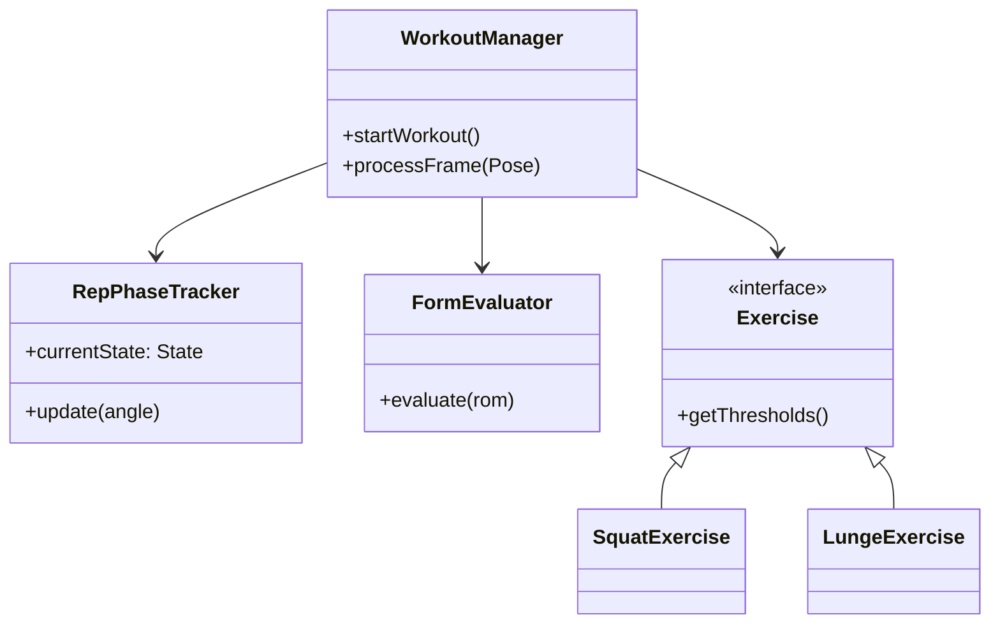

# Preparação Apresentação Final (Top-Down Completo)

Este é o documento de estudo exaustivo para a defesa do projeto **FitnessTracking**. Cobre desde as decisões de design embrionárias, passando pela Prova de Conceito em Python, até ao detalhe das implementações em Kotlin (packages e métodos) e arquitetura Firestore.

---

## 1. Evolução Histórica e Decisões de *Design* Críticas

Durante as várias *sprints* deste projeto, tomámos decisões de simplificação e refatorização vitais para garantir a entrega de um produto estável:

1. **Abandono do Python e adoção de Kotlin Nativo:**
   A diretoria `03_Implementacao/POC_Python` foi o nosso "balão de ensaio". Usámos Python com MediaPipe para iterar rapidamente a matemática dos ângulos. Contudo, tentar correr código Python num ambiente de produção Android (através de *Chaquopy* ou REST APIs) iria introduzir latência inadmissível. Reescrevemos tudo do zero em Kotlin para injetar a lógica diretamente no *pipeline* da `CameraX`, resultando num motor *Edge Computing* puro.
2. **Bloqueio da Orientação do Ecrã (Portrait Lock):**
   Decidimos trancar a App na orientação vertical (Portrait). *Porquê?* Rastrear corpos em modo de paisagem (Landscape) alteraria a matriz de coordenadas `X, Y` do MediaPipe, forçando a matemática a fazer transposições vetoriais constantes. Para além disso, no telemóvel pousado no chão, o modo vertical abrange muito melhor a altura total do corpo humano.
3. **Debounce do TTS (Text-to-Speech):**
   Durante os testes, reparámos que a IA disparava conselhos corretivos muito rapidamente. Implementámos um *debounce* temporal de 500ms no `TTSHelper` para garantir que o motor de voz acabava de falar antes de emitir um novo alerta, resolvendo o problema de sobreposição acústica.

---

## 2. Estrutura de Código Kotlin (Mergulho Profundo)

A base de código em `AndroidApp_V_0.1/app/src/main/java/com/example/fitnesstrackerapp` foi dividida metodicamente. Se o júri perguntar sobre a separação de responsabilidades, eis como funciona:

### 2.1. O *Package* `logic` (O "Cérebro" Biomecânico)
Este pacote não tem qualquer conhecimento de que existe uma Interface de Utilizador. É aqui que vive o motor:
*   **`AngleCalculator.kt`:** É a base cinesiológica. Recebe 3 *landmarks* do MediaPipe (ex: Anca, Joelho, Tornozelo), cria dois vetores e aplica-lhes a função trigonométrica Arco-cosseno ($\arccos$) combinada com o Produto Escalar. É independente da distância à câmara.
*   **`RepPhaseTracker.kt`:** Implementa a Máquina de Estados Finitos com 3 estados fixos (`AT_TOP`, `DESCENDING`, `ASCENDING`). Obriga a uma passagem sequencial rigorosa pelos limiares para validar uma repetição.
*   **`FormEvaluator.kt`:** Trata do modelo de pontuação biomecânica (Scoring). O cálculo não é binário (0 ou 100). Calcula uma penalização fracionária/proporcional com base no desvio entre o ângulo executado e o Limiar Ideal, maximizando a justiça para o utilizador.
*   **`WorkoutManager.kt`:** O Orquestrador. Submete cada frame recebida ao cálculo de ângulos, gere a máquina de estados e decide quando uma repetição está concluída e avaliada.

### 2.2. O *Package* `logic.impl` (Os Exercícios)
Onde o polimorfismo acontece. Cada exercício é uma classe separada:
*   **`SquatExercise.kt`, `PushUpExercise.kt`**: Herdam de uma interface comum. Definem os seus próprios 3 limiares (Extensão, Contagem, Ideal) baseados na literatura de Norkin e White.
*   **`LungeExercise.kt` (A resolução da Oclusão):** O grande desafio deste projeto. Como a perna de trás ficava tapada pela da frente, o `LungeExercise` introduziu código que avalia ativamente o eixo Z dos *landmarks* a cada milissegundo, rastreando apenas o joelho que estiver espacialmente mais próximo da câmara. Isto evitou termos de usar redes neurais secundárias pesadas.

### 2.3. O *Package* `ui` (Jetpack Compose)
*   **`MainActivity.kt` & `DashboardActivity.kt`:** Sem ficheiros XML antigos. Usámos Compose para gerar ecrãs modulares e reativos que se alteram automaticamente consoante os estados (`StateFlow`) emitidos pelo *ViewModel*.

---

## 3. Visualização de Arquitetura (Diagramas)

### 3.1. UML de Classes (O Padrão de *Strategy*)
Repara como o `WorkoutManager` não se preocupa se estás a fazer um agachamento ou flexão. Ele apenas chama a interface genérica `Exercise`:



### 3.2. Fluxo da Arquitetura (MVVM + Pipeline MediaPipe)
O júri pode perguntar como os dados chegam da lente da câmara até aos gráficos no ecrã:

```mermaid
flowchart TD
    A[CameraX] -->|Vídeo RAW| B(MediaPipe BlazePose)
    B -->|Extrai 33 Landmarks 3D| C{WorkoutManager}
    C -->|Calcula Ângulo| D[RepPhaseTracker]
    D -->|Emite Novo Estado (StateFlow)| E[ViewModel]
    E -->|Re-desenha a View| F[Jetpack Compose UI]
    C -.->|Termina Treino| G[(Firestore Transacional)]
```

### 3.3. Base de Dados Firestore (*Write-Time Aggregation*)
O Firestore no Firebase foi pensado para consultas ($O(1)$) altamente escaláveis. Em vez de calcular totais sempre que alguém abre a *Leaderboard*, gravamos os resultados consolidados diretamente no utilizador através de Transações Atómicas.

```mermaid
erDiagram
    USER_PROFILE ||--o{ WORKOUTS : "possui subcoleção"
    USER_PROFILE {
        string userId
        int weeklyKcal (Agregado O-1)
        int xpPoints (Agregado O-1)
        int level
    }
    WORKOUTS {
        string exerciseType
        int reps
        int score
    }
```
*Justificação:* Atualizar o `USER_PROFILE.weeklyKcal` usando uma transação atómica (Transaction) garante que se a internet falhar ou houver colisões de rede, a gravação de dados não fica corrompida nem as calorias se perdem. Isto foi uma evolução direta face ao armazenamento local instável do início do projeto.

---

## 4. Bateria Final de Perguntas e Respostas do Júri

**P1: Porque é que vocês acham que o vosso Lunge funciona bem quando até as frameworks do Google se baralham com oclusão?**
> "O MediaPipe do Google usa inferência inferida para tentar adivinhar a perna traseira bloqueada, gerando enorme ruído (jitter). Nós percebemos que para avaliar a biomecânica do Lunge não precisamos de duas pernas, apenas de analisar a coxa que está em maior tensão. Por isso, programámos o `LungeExercise.kt` para rastrear dinamicamente através do valor Z (profundidade) qual a perna mais próxima da câmara e isolar o cálculo angular exclusivamente nessa perna."

**P2: Se o MediaPipe gera dados a 30 Frames Por Segundo, como evitam o sobreaquecimento e o uso da bateria em dispositivos fracos?**
> "Usámos o mecanismo de *Frame Dropping* aliado ao *StateFlow* em Kotlin. A nossa UI não escuta *todas* as frames cegamente. O fluxo reativo tem mecanismos de suspensão (*Coroutines*) onde apenas a frame processada e validada aciona um re-desenho (Recomposition) da interface no Compose, reduzindo absurdamente a carga do CPU que existiria se usássemos a velha classe `View` do Android."

**P3: O que justificou passarem a usar as "Transações Firestore" a meio do vosso projeto?**
> "Precisávamos de evitar problemas de concorrência. Como a *Write-Time Aggregation* atualiza os pontos totais (XP) e Calorias no Perfil sempre que um treino acaba, usar comandos simples de gravação poderia originar *race conditions* (por exemplo, se dois dispositivos submetessem treinos ao mesmo tempo). Com Transações, garantimos a consistência ACID na Cloud."

**P4: Porquê bloquear a App em ecrã vertical (Portrait Lock) se poderiam ter oferecido ambas as opções?**
> "Foi uma decisão deliberada de Arquitetura de Visão Computacional, não de preguiça. Colocar um telemóvel no chão a 2 metros de distância em modo de paisagem (Landscape) 'corta' visualmente as pernas ou a cabeça de um atleta alto. O modo retrato abrange todo o volume vertical humano, crucial para extrair todos os 33 landmarks do BlazePose."
