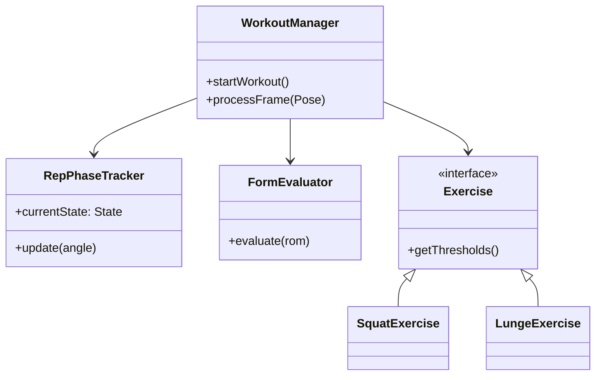
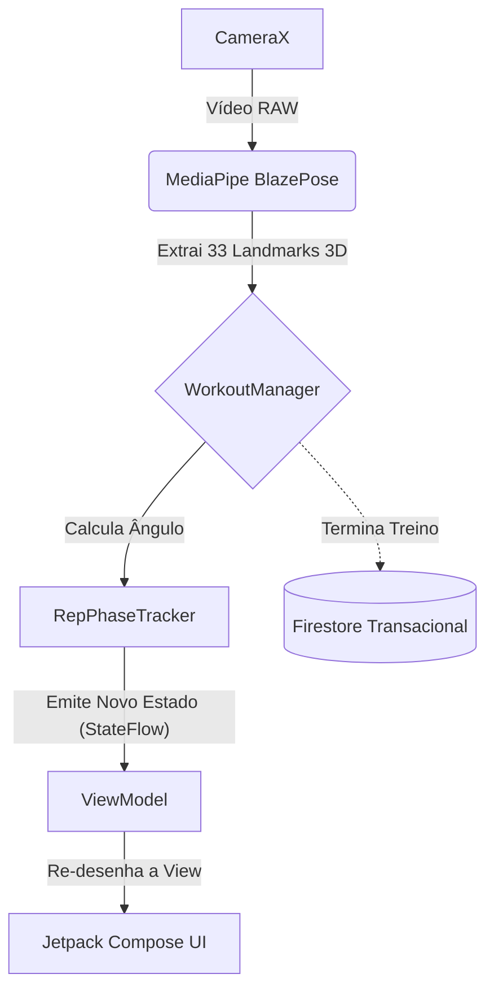
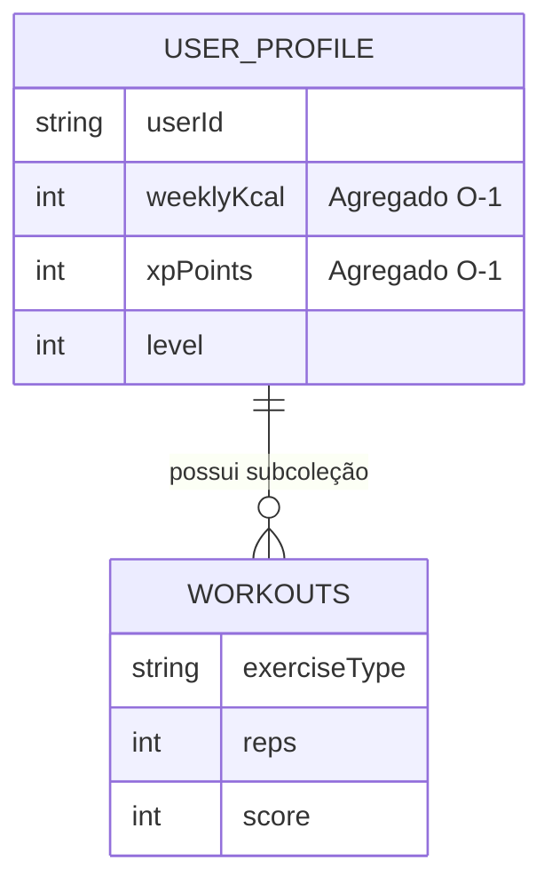

# Preparação Apresentação Final (Top-Down Completo)

Este é o documento de estudo exaustivo para a defesa do projeto **FitnessTracking**. Cobre desde as decisões de design embrionárias, passando pela Prova de Conceito em Python, até ao detalhe das implementações em Kotlin (packages e métodos), arquitetura Firestore, testes de usabilidade e restrições de Hardware.

---

## 1. Evolução Histórica e Decisões de *Design* Críticas

Durante as várias *sprints* deste projeto, tomámos decisões de simplificação e refatorização vitais para garantir a entrega de um produto estável:

1. **Abandono do Python e adoção de Kotlin Nativo:**
   A diretoria `03_Implementacao/POC_Python` foi o nosso "balão de ensaio". Usámos Python com MediaPipe para iterar rapidamente a matemática dos ângulos. Contudo, tentar correr código Python num ambiente de produção Android iria introduzir latência inadmissível. Reescrevemos tudo do zero em Kotlin para injetar a lógica diretamente no *pipeline* da `CameraX`, resultando num motor *Edge Computing* puro.
2. **Bloqueio da Orientação do Ecrã (Portrait Lock):**
   Decidimos trancar a App na orientação vertical (Portrait). *Porquê?* Rastrear corpos em modo de paisagem (Landscape) alteraria a matriz de coordenadas `X, Y` do MediaPipe, forçando a matemática a fazer transposições vetoriais constantes. Para além disso, no telemóvel pousado no chão, o modo vertical abrange muito melhor a altura total do corpo humano.
3. **Debounce do TTS (Text-to-Speech):**
   Implementámos um *debounce* temporal de 500ms no `TTSHelper` para garantir que o motor de voz acabava de falar antes de emitir um novo alerta, resolvendo o problema de sobreposição acústica.

---

## 2. Estrutura de Código Kotlin (Mergulho Profundo)

A base de código em `AndroidApp_V_0.1/app/src/main/java/com/example/fitnesstrackerapp` foi dividida metodicamente. 

### 2.1. O *Package* `logic` (O "Cérebro" Biomecânico)
*   **`AngleCalculator.kt`:** É a base cinesiológica. Recebe 3 *landmarks* do MediaPipe (ex: Anca, Joelho, Tornozelo), cria dois vetores e aplica-lhes a função trigonométrica Arco-cosseno ($\arccos$) combinada com o Produto Escalar. É independente da distância à câmara.
*   **`RepPhaseTracker.kt`:** Implementa a Máquina de Estados Finitos com 3 estados fixos (`AT_TOP`, `DESCENDING`, `ASCENDING`). Obriga a uma passagem sequencial rigorosa pelos três limiares (Extensão, Contagem, Ideal) para evitar *jitter* e contagens falsas.
*   **`FormEvaluator.kt`:** Trata do modelo de pontuação biomecânica (Scoring). Calcula uma penalização fracionária/proporcional com base no desvio entre o ângulo executado e o Limiar Ideal.
*   **`WorkoutManager.kt`:** O Orquestrador. Submete cada frame recebida ao cálculo de ângulos e gere a máquina de estados.

### 2.2. O *Package* `logic.impl` (Os Exercícios e Polimorfismo)
*   **`LungeExercise.kt` (A resolução da Oclusão):** Introduziu código que avalia ativamente o eixo Z dos *landmarks* a cada frame, rastreando apenas o joelho que estiver espacialmente mais próximo da câmara. Isto evitou usar redes neurais secundárias pesadas.

### 2.3. O *Package* `ui` (Jetpack Compose Nativo)
*   **`MainActivity.kt` & `DashboardActivity.kt`:** Sem ficheiros XML antigos. Usámos Compose para gerar ecrãs modulares e reativos geridos por `StateFlow`. Desenhámos os gráficos do Dashboard através do **Jetpack Compose Canvas nativo**.

---

## 3. Visualização de Arquitetura (Diagramas)

### 3.1. UML de Classes (O Padrão de *Strategy*)

### 3.2. Fluxo da Arquitetura (MVVM + Pipeline MediaPipe)

### 3.3. Base de Dados Firestore (*Write-Time Aggregation*)

*Justificação:* Atualizar o `USER_PROFILE.weeklyKcal` com Transações assegura a sincronização *Offline-First* e garante que a *Leaderboard* lê tudo em complexidade $O(1)$.

---

## 4. Testes, Validação e Hardware (Os Bastidores)

### 4.1. Avaliação SUS e Ações Corretivas de UX
Nos testes (pasta `04_Teste`), o nosso score SUS de 66.42 forçou-nos a implementar soluções críticas:
- **Localização:** Traduzimos toda a app para Português (PT-PT) para o grupo de literacia baixa.
- **Redimensionamento Vetorial (HUD):** Aumentámos drasticamente as métricas da interface visual.

### 4.2. A Restrição de Hardware (x86_64 vs ARM64-v8a)
O MediaPipe Pose depende de binários compilados em C++ para a arquitetura **ARM64-v8a**. Isto causa incompatibilidade total com os Emuladores do Android Studio (x86_64), forçando e provando que o projeto é testado 100% num pipeline local Mobile real.

---

## 5. Guião de Defesa Exaustivo: Bateria de Perguntas (Classificadas)

Para facilitar a memorização visual e direcionamento estratégico, as perguntas estão categorizadas por domínio de engenharia.

### 🗄️ 5.1. Temática A: Infraestrutura e Base de Dados
**P1: O processamento no "Edge" significa que o poder está todo no telemóvel. Se o telemóvel perder internet, o treino e XP não se perdem antes de chegar ao Firestore?**
> **Resposta:** "Não, graças à arquitetura *Offline-First* do SDK nativo do Firebase. A gravação do *Score* é despachada para a cache SQLite segura local em background. Se não houver internet, a alteração de XP e Kcal descansa no telemóvel. Assim que a conectividade for restaurada no futuro, o SDK trata de escoar a fila assíncrona, resolvendo conflitos na Cloud, sem qualquer perda silenciosa."

**P2: Porque a escolha de NoSQL e "Write-Time Aggregation"? O projeto tem relações (Utilizadores têm Treinos e Amigos), porque não usaram SQL Clássico (Room)?**
> **Resposta:** "Porque o padrão vital deste negócio é ver a *Leaderboard* num relance de milissegundos. Se usássemos SQL, um `JOIN` massivo ia percorrer os 500 treinos de 30 amigos em 'Read-Time' cada vez que mudássemos de separador. Ao aplicarmos *Write-Time Aggregation* (agregando Totais de Pontos/Kcal no `UserProfile`), sacrificámos a Normalização do SQL para ganhar uma *Query* linear em $O(1)$. Na Cloud (onde se paga por documento lido), o SQL faliria a empresa; a nossa abstração NoSQL garante sobrevivência comercial."

### 🤖 5.2. Temática B: IA, Computação de Visão e Metodologia Científica
**P3: Como é que o MediaPipe lida com diferentes telemóveis? Numa câmara de 108 Megapíxeis, a matemática não engasga a bateria e o CPU?**
> **Resposta:** "Esse é o segredo de eficiência da framework. O *pipeline* nunca infere a imagem nativa. A `CameraX` redimensiona (*downscale* agressivo) a frame para um tensor matriz muito pequeno (normalmente 256x256) antes de o passar para a Rede Neural. É por isso que mantemos estáveis as ~30 FPS independentemente do tamanho original da foto, gerindo o sobreaquecimento através do processo `STRATEGY_KEEP_ONLY_LATEST` para descartar *frames* velhas em fila."

**P4: O vosso Lunge funciona perfeitamente, mas a oclusão destrói dezenas de IAs concorrentes. O que fizeram de diferente de 'adivinhar' a perna tapada?**
> **Resposta:** "Aplicámos a 'Navalha de Ockham': não adianta extrapolar um esqueleto 3D que não está visível. A nossa física dita que num Lunge apenas a perna da frente avalia a postura e amplitude. Programámos a classe `LungeExercise.kt` para ler dinamicamente o *Eixo Z* a cada milissegundo, injetando o cálculo angular exclusivamente no joelho temporalmente mais perto da câmara, ignorando estaticamente a perna oculta e erradicando os *falsos-negativos*."

**P5: O vosso relatório refere o uso de LLMs e IA Generativa. Qual foi a percentagem de 'cópia'? Se a Matemática foi gerada, como garantem a correção?**
> **Resposta:** "A IA funcionou estritamente como *Pair-Programmer* para 'Boilerplate'. O *Model Design* (Arquitetura) foi absolutamente nosso. Nós instruímos o modelo a gerar o 'cross-product e arccos', mas fomos nós a fechar a arquitetura limitativa de 3 limiares na máquina de estados (Contagem, Ideal, Extensão). A prova empírica encontra-se no mapeamento da teoria Goniométrica (Norkin e White) adaptada por nós a esses 3 Limiares. O LLM escreve rápido, mas quem orquestra a viabilidade é a anotação metódica que fizemos de `#my_code`."

### 🔬 5.3. Temática C: Casos Limite Ambientais e Morfológicos (Distância, Cor e Luz)
**P6: A que distância funciona a App? Funciona se o telemóvel estiver a 0.5 metros da minha cara, ou se eu estiver a 20 metros no fundo do corredor de um ginásio?**
> **Resposta:** "Não funciona em nenhum desses dois extremos mecânicos. A 0.5m, o *Bounding-Box* de extração do BlazePose não vislumbra o corpo todo (cortando joelhos vitais para Agachamentos). A 20 metros, existem píxeis insuficientes no rosto humano para gerar Confiança Vetorial. A nossa *Sweet Spot* é de **2 a 6 metros**. E é por isso que, de acordo com o nosso teste de usabilidade (SUS), nós duplicámos o HUD (Fontes e Gráficos); precisamente para o atleta conseguir ler o ecrã a 4 metros com eficácia e conforto total."

**P7: E se um atleta obeso usar calças largas e pretas num quarto pouco iluminado? O modelo distorce o esqueleto? E detetam pessoas sem braços?**
> **Resposta:** "Este é o clássico obstáculo de IAs puramente baseadas em processadores RGB (que dependem de deteção de margens). Falta de contraste luminoso ou roupas excessivamente largas perdem a margem visual. Para contornar este viés (*Bias*) endémico e o problema de partes corporais amputadas, lidamos defensivamente usando a propriedade `Visibility` ou de Confiança do MediaPipe. Se a confiança num ombro, pulso ou joelho cair vertiginosamente abaixo da *threshold*, a nossa Máquina de Estados "congela", bloqueando as contas para evitar que um tremor da perna produza 3 repetições falsas seguidas."

### 💻 5.4. Temática D: Código-Fonte Kotlin Puro e Padrões
**P8: Eu olhei para o vosso código do `AngleCalculator.kt`. Vejo que aplicam a Matemática Vetorial e o arco-cosseno. Como é que evitam exceções de 'Divisão por Zero' que fariam *Crash* instantâneo à app no telemóvel dos clientes?**
> **Resposta:** "Essa é uma das barreiras críticas da Cinesiologia Vetorial que tratámos de defender no código. Se três articulações colapsarem visualmente na mesma coordenada $(X, Y)$, os vetores do osso passam a ter magnitude 0. No Produto Escalar, isto criaria divisão por zero, devolvendo `NaN` (Not a Number). Resolvemos isto usando os mecanismos de segurança nativos de Kotlin: funções de verificação explícitas para garantir que a `magnitude > 0.0`. E para evitar que pequenos arredondamentos flutuantes em hardware (ex: `1.0000001`) estoirem o `arccos()`, forçámos os resultados para dentro do domínio rigoroso trigonométrico `[-1.0, 1.0]` com a função `coerceIn` antes do cálculo final."

**P9: Usam a classe `WorkoutManager`, que injeta lógica num ecrã em Kotlin. Isso não deita fora toda a arquitetura de independência do MVVM (*Model View ViewModel*)?**
> **Resposta:** "Não, e esse foi o nosso maior orgulho de arquitetura. O `WorkoutManager` é agnóstico. Ele não importa nenhuma referência do Android (como Context, SurfaceViews ou Activity). O único canal que ele tem com o exterior é receber objetos `Pose` puros através de uma Ponte Analisadora (ImageAnalyzer) e descarregar atualizações (via *StateFlow*) no *ViewModel*. O *Jetpack Compose* só tem o trabalho de renderizar as coisas de acordo com o fluxo do *StateFlow*. É Separação de Interesses (SoC) pura."

**P10: E se o utilizador clicar na seta de 'Sair a meio do treino' enquanto o BlazePose e os Cálculos ainda estão freneticamente a avaliar os vetores ósseos da última *frame*? Ocorrem *Memory Leaks*?**
> **Resposta:** "Não, porque todo o nosso processamento matemático obedece à estrutura limpa de `Kotlin Coroutines` despachadas do `viewModelScope` e do seu *Dispatcher* nativo (para não bloquear a UI). Assim que a atividade morre no ecrã e é invocada a destruição (OnDestroy), as dependências associadas ao escopo da *Coroutine* são sumariamente canceladas. O telemóvel liberta logo a RAM do BlazePose."
