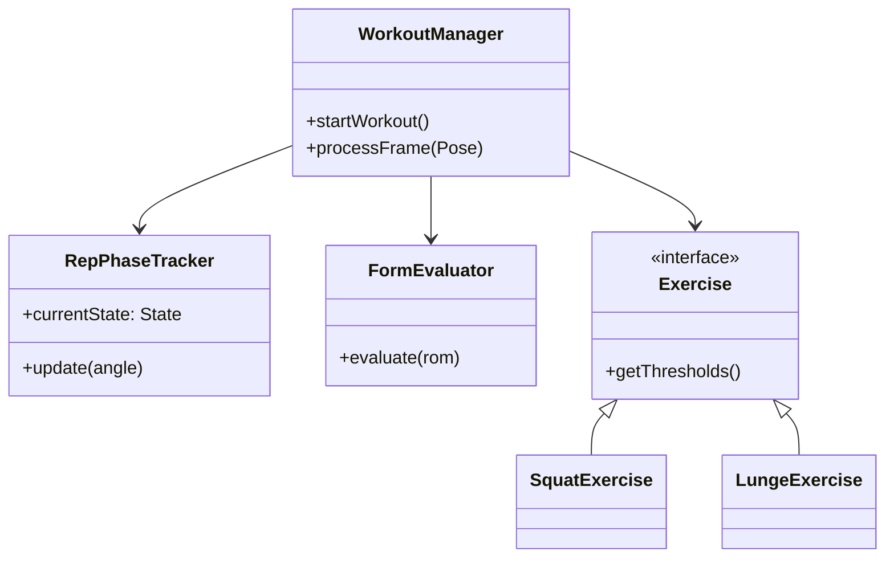
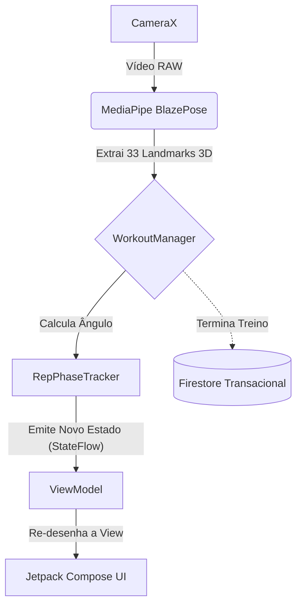
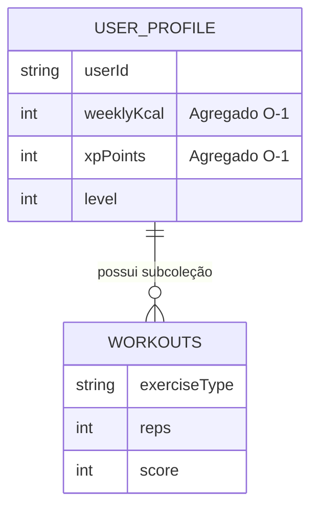

# Preparação Apresentação Final (Top-Down Completo)

Este é o documento de estudo exaustivo para a defesa do projeto **FitnessTracking**. Cobre desde as decisões de design embrionárias, passando pela Prova de Conceito em Python, até ao detalhe das implementações em Kotlin (packages e métodos), arquitetura Firestore, testes de usabilidade e restrições de Hardware.

---

## 1. Evolução Histórica e Decisões de *Design* Críticas

Durante as várias *sprints* deste projeto, tomámos decisões de simplificação e refatorização vitais para garantir a entrega de um produto estável:

1. **Abandono do Python e adoção de Kotlin Nativo:**
   A diretoria `03_Implementacao/POC_Python` foi o nosso "balão de ensaio". Usámos Python com MediaPipe para iterar rapidamente a matemática dos ângulos. Contudo, tentar correr código Python num ambiente de produção Android (através de *Chaquopy* ou REST APIs) iria introduzir latência inadmissível. Reescrevemos tudo do zero em Kotlin para injetar a lógica diretamente no *pipeline* da `CameraX`, resultando num motor *Edge Computing* puro.
2. **Bloqueio da Orientação do Ecrã (Portrait Lock):**
   Decidimos trancar a App na orientação vertical (Portrait). *Porquê?* Rastrear corpos em modo de paisagem (Landscape) alteraria a matriz de coordenadas `X, Y` do MediaPipe, forçando a matemática a fazer transposições vetoriais constantes. Para além disso, no telemóvel pousado no chão, o modo vertical abrange muito melhor a altura total do corpo humano.
3. **Debounce do TTS (Text-to-Speech):**
   Durante os testes, reparámos que a IA disparava conselhos corretivos muito rapidamente. Implementámos um *debounce* temporal de 500ms no `TTSHelper` para garantir que o motor de voz acabava de falar antes de emitir um novo alerta, resolvendo o problema de sobreposição acústica.

---

## 2. Estrutura de Código Kotlin (Mergulho Profundo)

A base de código em `AndroidApp_V_0.1/app/src/main/java/com/example/fitnesstrackerapp` foi dividida metodicamente. 

### 2.1. O *Package* `logic` (O "Cérebro" Biomecânico)
Este pacote não tem qualquer conhecimento de que existe uma Interface de Utilizador. É aqui que vive o motor:
*   **`AngleCalculator.kt`:** É a base cinesiológica. Recebe 3 *landmarks* do MediaPipe (ex: Anca, Joelho, Tornozelo), cria dois vetores e aplica-lhes a função trigonométrica Arco-cosseno ($\arccos$) combinada com o Produto Escalar. É independente da distância à câmara.
*   **`RepPhaseTracker.kt`:** Implementa a Máquina de Estados Finitos com 3 estados fixos (`AT_TOP`, `DESCENDING`, `ASCENDING`). Obriga a uma passagem sequencial rigorosa pelos três limiares (Extensão, Contagem, Ideal) para evitar *jitter* e contagens falsas.
*   **`FormEvaluator.kt`:** Trata do modelo de pontuação biomecânica (Scoring). Calcula uma penalização fracionária/proporcional com base no desvio entre o ângulo executado e o Limiar Ideal (amplitude de movimento - ROM), maximizando a justiça para o utilizador. Deduz também pontos fixos pela cadência (muito rápido ou muito lento).
*   **`WorkoutManager.kt`:** O Orquestrador. Submete cada frame recebida ao cálculo de ângulos, gere a máquina de estados e decide quando uma repetição está concluída e avaliada.

### 2.2. O *Package* `logic.impl` (Os Exercícios e Polimorfismo)
*   **`LungeExercise.kt` (A resolução da Oclusão):** O grande desafio deste projeto. Como a perna de trás ficava tapada pela da frente, o `LungeExercise` introduziu código que avalia ativamente o eixo Z dos *landmarks* a cada frame, rastreando apenas o joelho que estiver espacialmente mais próximo da câmara. Isto evitou usar redes neurais secundárias pesadas.

### 2.3. O *Package* `ui` (Jetpack Compose Nativo)
*   **`MainActivity.kt` & `DashboardActivity.kt`:** Sem ficheiros XML antigos. Usámos Compose para gerar ecrãs modulares e reativos que se alteram automaticamente consoante os estados (`StateFlow`) emitidos pelo *ViewModel*. Note-se que desenhámos os gráficos do Dashboard através do **Jetpack Compose Canvas nativo**, sem recorrer a bibliotecas de terceiros.

---

## 3. Visualização de Arquitetura (Diagramas)

### 3.1. UML de Classes (O Padrão de *Strategy*)

### 3.2. Fluxo da Arquitetura (MVVM + Pipeline MediaPipe)

### 3.3. Base de Dados Firestore (*Write-Time Aggregation*)

*Justificação:* Atualizar o `USER_PROFILE.weeklyKcal` e os Pontos de Experiência usando uma transação atómica garante que ler os dados para a *Leaderboard* custa sempre 1 única operação de leitura por amigo, garantindo escalabilidade $O(1)$ e baixos custos na Cloud.

---

## 4. Testes, Validação e Hardware (Os Bastidores)

### 4.1. Avaliação SUS e Ações Corretivas de UX
Fizemos testes com utilizadores reais (pasta `04_Teste`) focados na literacia tecnológica (Baixa, Média, Avançada). O nosso score *System Usability Scale* (SUS) de 66.42 forçou-nos a implementar soluções críticas:
- **Localização:** Traduzimos toda a app para Português (PT-PT) devido a barreiras de linguagem do grupo de literacia baixa.
- **Redimensionamento Vetorial (HUD):** Aumentámos as métricas visuais porque a App é concebida para ser usada a uma distância focal de 2 a 6 metros do dispositivo.

### 4.2. A Restrição de Hardware: O Pesadelo do Emulador (x86_64 vs ARM64-v8a)
Uma das maiores dificuldades de engenharia foi a compilação do projeto. A biblioteca MediaPipe Pose no Android depende de ficheiros binários em C++ compilados para a arquitetura **ARM64-v8a** (processadores de smartphones reais). Isto causou a incompatibilidade total com os Emuladores do Android Studio (que rodam em x86_64 nos nossos computadores). 
**Argumento:** "A nossa aplicação foi pensada desde o dia 1 para *Edge Computing* em silício mobile real. Como consequência inerente à utilização de redes neurais otimizadas (TFLite/C++ ARM), os testes e compilações são obrigatoriamente feitos em dispositivos físicos via USB."

### 4.3. Metodologia de IA (Academic Integrity)
A abordagem à IA Generativa foi transparente e rastreável. Usámos o documento `prompt_set.txt` e marcadores como `#my_code` no código-fonte para separar claramente o que foi arquitetado e pensado por nós, e o que foi gerado iterativamente pelo LLM. A IA serviu como "Pair Programmer" e não como orquestradora.

---

## 5. Bateria Final de Perguntas e Respostas do Júri (O "Grill-Me")

**P1: Porque é que vocês acham que o vosso Lunge funciona bem quando até as frameworks do Google se baralham com oclusão?**
> "O MediaPipe do Google usa inferência inferida para tentar adivinhar a perna traseira bloqueada, gerando enorme ruído (jitter). Nós percebemos que para avaliar a biomecânica do Lunge não precisamos de duas pernas, apenas de analisar a coxa que está em maior tensão. Por isso, programámos o `LungeExercise.kt` para rastrear dinamicamente através do valor Z (profundidade) qual a perna mais próxima da câmara e isolar o cálculo angular exclusivamente nessa perna."

**P2: Se o MediaPipe gera dados a 30 Frames Por Segundo, como evitam o sobreaquecimento e o uso da bateria em dispositivos fracos?**
> "Usámos o mecanismo de *Frame Dropping* no lado do CameraX aliado ao *StateFlow* em Kotlin. A UI reativa tem mecanismos de suspensão (*Coroutines*) onde apenas a frame processada e validada aciona um re-desenho (Recomposition) no Compose, reduzindo a carga do CPU."

**P3: O vosso SUS score foi de 66.42, o que é abaixo da média da indústria (68). Como é que chamam a isto um sucesso?**
> "O valor de 66.42 não foi o fim do projeto, foi a nossa *baseline*. Ele foi arrastado para baixo pelos utilizadores de Literacia Baixa, e graças a isso fizemos refatorizações cruciais (localização PT-PT e redimensionamento do HUD para leitura a 4 metros). Este score prova a importância dos testes com utilizadores reais e não viciados."

**P4: Porquê a escolha de NoSQL e do Padrão "Write-Time Aggregation"?**
> "Se tivéssemos de somar a coleção `workouts` inteira sempre que mostramos a Leaderboard, teríamos de iterar $N$ documentos, o que em SQL seria um JOIN simples, mas no Firestore pagamos por leitura de documento, logo a fatura escalaria de forma exponencial. Decidimos sacrificar a Terceira Forma Normal e desnormalizar os dados, guardando totais de Kcal e XP no Perfil do Utilizador (uma única transação atómica O-1).

**P5: Porque dizem que não funciona no simulador/emulador do computador?**
> "Porque a inferência de IA real não acontece em Java. O coração do MediaPipe são bibliotecas em C++ compiladas para arquiteturas de silício mobile (ARM64-v8a). Os nossos computadores são x86_64, provocando falhas de ABI (*Application Binary Interface*). É uma prova provada de que criámos uma verdadeira app *Edge* nativa."
